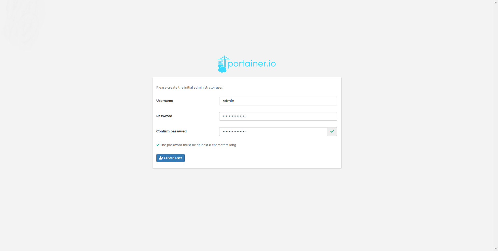
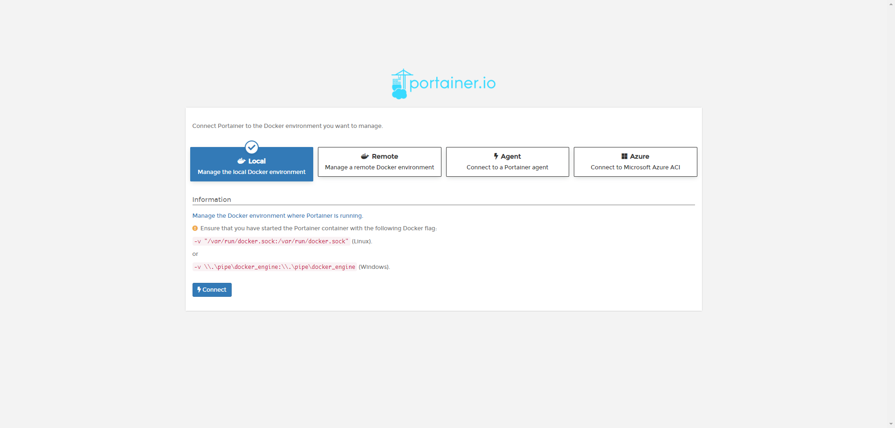

# 云计算实验指南

[toc]

---

## 实验一 Docker的安装与使用

### 实验目的

- 了解Docker的用途、基本运行原理
- 掌握Docker的常见使用方式
- 了解Docker的部分高级应用
- 了解Dockerfile的用法以及基本结构
- 学习如何构建并部署自己的容器

### Docker简介

> Docker是一个开源的应用容器引擎，让开发者可以打包他们的应用以及依赖包到一个可移植的镜像中，然后发布到任何流行的Linux或Windows机器上，也可以实现虚拟化。容器是完全使用沙箱机制，相互之间不会有任何接口。

### 安装Docker

> **分发给大家的虚拟机已经安装好了Docker，使用实验虚拟机进行实验无需进行本步操作。**

为了后续实验不会碰到太多问题，尽管Docker同样可以以某些方式安装在Windows系统上，但我们不采取这种方式；同理，也不在WSL中安装。

>根据[Docker官方文档](https://docs.docker.com/install/)，docker支持Ubuntu 16.04(LTS)或更新版本、CentOS 7等版本的操作系统。其他Linux发行版请到docker官方文档查看是否支持。

32位系统可能会带来额外的工作量以及其它未知的问题。

- 更新已有的包，避免之后出现问题  `sudo apt-get update`
- 安装所需组件 `apt-get install apt-transport-https ca-certificates curl software-properties-common -y`
- 添加Docker源
  
  ```command
  curl -fsSL https://download.docker.com/linux/ubuntu/gpg | apt-key add -
  add-apt-repository "deb [arch=amd64] https://download.docker.com/linux/ubuntu $(lsb_release -cs) stable"
  apt update
  ```

- 安装Docker(注：为了与之后的Kubernetes兼容，需要手动指定Docker版本)
  `apt install docker-ce=18.06.3~ce~3-0~ubuntu`
- 验证Docker是否成功安装
  `docker -v`
  `Docker version 18.06.3-ce, build d7080c1`
- 至此，Docker安装完毕

### Docker的基本使用

#### 第一个Docker应用

> 本节以安装、运行一个Docker的UI管理平台为例。如果下载速度较慢，参见下一节末尾更换镜像源的方法。

- 下载镜像
  `docker pull portainer/portainer`
  - 成功后会显示`{dockerid}: Pull complete`,其中{dockerid}为镜像在本地的ID
- 查看镜像列表
  `docker images`

    ```command
    root@roycent-Ali2:~# docker images
    REPOSITORY            TAG                 IMAGE ID            CREATED             SIZE
    portainer/portainer   latest              ff4ee4caaa23        2 months ago        81.6MB
    ```
  
> **注意**
>
> 实验虚拟机中可能已经有了一些其他的镜像，这些镜像在之后的实验中会用到，**不要**删除这些镜像，也不要修改、运行。

- 启动容器运行该镜像
  `docker run -d -p 9000:9000 -p 8000:8000 --name portainer --restart always -v /var/run/docker.sock:/var/run/docker.sock -v`
  `portainer_data:/data portainer/portainer`
- 现在，该管理平台已经运行在docker中，可以通过9000端口进行访问并设置密码。
    
- 连接方式选择`local`
    
- 在主机中查看容器列表
  `docker container ls`或`docker ps`  
  > 注意：`docker ps`命令只会显示正在运行的容器，若想查看所有容器，则要使用`docker ps -a`命令

  ```command
    CONTAINER ID        IMAGE                 COMMAND             CREATED             STATUS              PORTS                                            NAMES
    1e30cc274e74        portainer/portainer   "/portainer"        About an hour ago   Up About an hour    0.0.0.0:8000->8000/tcp, 0.0.0.0:9000->9000/tcp   portainer
  ```

>注意：
>
> - 如果使用云服务器，请检查服务器防火墙设置（包括操作系统防火墙，以及云服务提供商的防火墙）。并且不推荐将端口设置为80、443等HTTP默认端口，在未备案的情况下，云服务提供商一般不会提供这两个端口的HTTP访问。
> - 如果使用本地虚拟机，本地访问时直接使用虚拟机IP即可。跨设备访问（比如使用另一台电脑/手机访问）时，需要将网络设置为NAT模式，访问时需访问物理机的IP及NAT设置的端口。

下面，我们将以刚刚下载镜像并启动第一个容器的命令为例，说明`docker`命令的基本用法。

#### docker pull

> [*Docker Hub*](https://hub.docker.com)是Docker官方维护的公共镜像仓库，现在已经有了超过300万个镜像。它的功能与*Github*类似，你可以将自己的Docker上传至*Docker Hub*分享给其他人，也可以下载使用其他人的开源Docker镜像，避免重复造轮子。

用法：
`docker pull [OPTIONS] NAME[:TAG|@DIGEST]`

与`git pull`类似，`docker pull`后添加需要下载的镜像名即可将镜像下载至本地。一般地，镜像名格式为`{作者名}/{镜像名}`，例如本例中使用的portainer。对于其他部分常用的操作系统（如CentOS）、编程语言运行时（如Java）、数据库（如MySQL）等，Docker官方提供了一系列官方镜像存储库（*Docker Official Images*）。在下载这些存储库时，无需添加作者名，直接添加镜像名即可（尽管它们实际上也在`library`名下），如`docker pull mysql`。
如果一个镜像存在着多种版本，则在镜像名后用`:`分隔添加版本号，如`docker pull mysql:8`。不添加TAG时，则默认使用latest，拉取最新版本的镜像。

> 由于*Dokcer Hub*服务器速度受限，在下载较大镜像时速度很慢，因此最好使用国内的Docker镜像源。执行如下命令即可更换Docker镜像源并重启Docker：
>
>```command
>mkdir -p /etc/docker
>tee /etc/docker/daemon.json <<-'EOF'
>{
>  "registry-mirrors": ["https://docker.mirrors.ustc.edu.cn"]
>}
>EOF
>systemctl daemon-reload
>systemctl restart docker
>```
>
>其中，`registry-mirrors`中镜像地址可以也替换成其它的地址。
>
>一些Docker镜像地址：
>
>- Docker中国官方镜像 `https://registry.docker-cn.com`
>- 中科大Docker镜像 `https://docker.mirrors.ustc.edu.cn`
>- 微软Azure镜像 `https://dockerhub.azk8s.cn`
>
>如果Docker部署在云服务器上，使用云提供商的镜像加速器速度会有飞跃性的提升。以阿里云提供的镜像加速器为例，在[容器镜像服务](https://www.aliyun.com/product/acr)中进入管理控制台，登录后即可在左侧镜像加速器一栏中查看镜像地址。

对于镜像的搜索，可以在[*Docker Hub* 官网](https://hub.docker.com)搜索，也可以使用`docker search`命令。例如搜索MySQL镜像：

```command
root@roycent-Ali2:~# docker search mysql
NAME                              DESCRIPTION                                     STARS               OFFICIAL            AUTOMATED
mysql                             MySQL is a widely used, open-source relation…   9110                [OK]  
mariadb                           MariaDB is a community-developed fork of MyS…   3218                [OK]  
mysql/mysql-server                Optimized MySQL Server Docker images. Create…   674                                     [OK]
```

#### docker run

对于一般的用户，`docker run`命令是最常用也是最复杂的命令之一。`docker run`命令用于创建并运行容器。完整的命令参数及用法参见[Docker官方文档](https://docs.docker.com/engine/reference/commandline/run/)，下面仅以刚刚执行过的`docker run`命令为例，说明部分常用的参数意义。

用法：
`docker run [OPTIONS] IMAGE [COMMAND] [ARG...]`

>注意：将参数放在需要启动的镜像名前，以免引起不必要的错误。如，应使用`docker run -v /var/run/docker.sock:/var/run/docker.sock portainer`，**而不是**`docker run portainer -v /var/run/docker.sock:/var/run/docker.sock`

- `-d`
  - `--detach`，以后台模式运行容器并打印容器ID。类似于Linux命令中的`nohup {command} &`。一般情况下，运行服务都会添加此参数，否则容器会在前台运行。
- `-p`
  - `--publish`，将容器的端口发布至主机，与端口映射相似。`:`前为使用的主机端口，`:`后为容器的端口，二者可以不同，即可以将容器中的一个端口映射至主机的任一未占用端口。
- `--name`
  - 容器的名字，即在`docker ps`中查看到的`NAMES`，方便辨识容器。如果不指定此参数，Docker会随机生成一个名字。
- `-v`
  - 绑定的外部数据集。`:`前为主机中的文件或路径，`:`后的为容器中的文件或路径。需要存储数据或者使用主机中资源的容器需要设置该参数。在刚刚执行过的`docker run`命令中，由于要通过该平台管理docker，因此要将docker接收socket请求的`docker.sock`路径传入容器；同时，为了方便数据的管理、备份以及数据安全，将容器中的数据存储到容器外，即`portainer_data`文件夹中。需要注意的是，本例中填写的路径是相对路径，数据会存储在docker安装路径下的`volumes`文件夹中。默认的安装路径是`/var/lib/docker`，即本例中数据会存储在`/var/lib/docker/volumes/portainer_data`中。
- `--restart`
  - 容器的重启策略，通常与`-d`参数一起使用。默认选项为`no`。`docker run`在退出时会产生一系列状态码，例如0为正常退出、127为容器调用的命令不存在等。这个参数控制了容器退出（包括正常退出、遇到错误退出）时，是否进行重启。本例中使用的`always`选项策略，为无论容器因何退出，都将重启以保证服务的正常运行。
- `-e`
  - 容器的环境变量。某些容器需要指定初始的参数来保证应用的正常运行，例如MySQL容器在启动时需要指定初始密码（或设置为允许空密码、自动生成随机密码）来保证MySQL的访问及安全：`docker run -e MYSQL_ROOT_PASSWORD=@buaa21 mysql`

> Docker在运行“服务类容器”（如MySQL、Nginx等）之外，还可能会运行“工作类容器”（某些一次性或有限次执行的脚本等）。

#### docker exec

>本节使用MySQL容器为例，在学习`exec`命令前要拉取并运行MySQL容器：
>
>```command
>docker pull mysql
>docker run -d -e MYSQL_ROOT_PASSWORD=@buaa21 -p 8006:3306 --name mysql mysql
>```

`docker exec`命令用于在容器中执行命令。
用法：
`docker exec [OPTIONS] CONTAINER COMMAND [ARG...]`
其含义为：在容器CONTAINER中，执行命令COMMAND \[ARG...]

- 查看mysql容器中home文件夹中的文件（在mysql容器中执行`ls /root`）
  `docker exec mysql ls /root`
  由于home文件夹中没有文件，该命令没有输出
- 在mysql容器的home文件夹中创建文件
  `docker exec mysql touch /root/test_exec.tmp`
- 再次查看容器中home文件夹中的文件
  `docker exec mysql ls ~`
  可以查看到新建的文件，说明命令执行成功
  
  ```command
  root@roycent-Ali2:~# docker exec mysql ls ~
  test_exec.tmp
  ```

- 对于更加复杂的指令，可以调用容器中的bash来执行
  - `docker exec mysql /bin/bash`
    然而，执行这句命令之后不会有任何输出，也不会要求继续输入。正确的命令应该为：
  - `docker exec -it mysql /bin/bash`

    ```command
    root@roycent-Ali2:~# docker exec -it mysql /bin/bash
    root@24c575abf8ed:/#
    ```

  这样，就相当于进入了容器内部，可以像在一般Linux设备中执行命令。在本例中，可以用此方法管理MySQL数据库：
  - `mysql -uroot -p`
  
  ```command
  root@24c575abf8ed:/# mysql -uroot -p
  Enter password:
  Welcome to the MySQL monitor.  Commands end with ; or \g.
  ```

>要退出容器bash时，输入`exit`命令即可

- `-i`参数
  - `--interactive`，即使没有连接，也保持容器的标准输入打开。不加`-i`参数时，如果没有输入流衔接，bash就会关闭。
- `-t`参数
  - `--tty`，分配一个“冒充的”终端设备。与`-i`结合使用，就会达到产生一个模拟终端，并保持正常交互的作用。
- `-d`参数
  - `--detach`，与`run`命令中的`-d`参数类似，这里的`-d`参数也是将命令在后台运行。

#### 常用docker命令

[Docker CLI 文档](https://docs.docker.com/engine/reference/commandline/docker/)中包含了更加详细和全面的docker命令用法。

- 容器生命周期管理
  - run：创建并启动容器
  - start/stop/restart：启动/停止/重启容器
  - kill：杀掉容器
  - rm：删除容器
  - pause/unpause：暂停运行/恢复运行容器
  - create：创建容器（但不启动）
  - exec：在容器中执行命令
- 容器管理操作
  - ps：列出本地容器
  - inspect：查看容器或镜像的元数据
  - top：查看容器中正在运行的进程信息
  - attach：连接到正在运行中的容器
    - 由于一般容器都以守护态后台运行，无法通过attach命令进入容器，常用进入容器的命令为`exec -it CONTAINER /bin/bash`
  - logs：获取容器日志
  - wait：阻塞运行直到容器停止，然后打印出它的退出代码
  - export：将文件系统作为一个tar归档文件导出
  - port：列出指定容器的端口映射
  - system
    - system df：查看磁盘使用情况
    - system events：查看实时事件
    - system info：查看docker系统信息
    - system prune：删除无用数据
  - stats：查看各个容器的运行状态
- 容器rootfs操作
  - commit：从容器创建一个新的镜像
  - cp：在容器与主机之间拷贝数据
  - diff：检查容器里文件结构的更改
- 容器镜像仓库操作
  - login/logout：登录/登出Docker镜像仓库，默认为Docker Hub
  - pull：拉取/更新镜像
  - push：将镜像上传到镜像仓库
  - search：从Docker Hub查找镜像
- 本地镜像管理
  - images：列出本地镜像
  - rmi：删除本地镜像
  - tag：标记本地镜像，将其归入某一仓库
  - build：使用Dockerfile创建镜像
  - history：查看镜像的创建历史
  - save：将镜像保存成tar归档文件
  - load：导入镜像的tar归档文件
  - import：从归档文件中创建镜像
- 容器信息查看
  - version：查看容器版本信息

### 构建定制镜像

#### Dockerfile

>Dockerfile是一个用来构建镜像的文本文件，文件中包含了一条条构建镜像所需的指令和说明。本节使用一个的Nginx镜像，运行一个简单的HTML网页来说明Dockerfile如何工作。官方文档提供的[Dockerfile 最佳实践](https://docs.docker.com/develop/develop-images/dockerfile_best-practices/)会提供更多有用的细节。

- 编写Dockerfile
  
  ```Dockerfile
  FROM nginx
  RUN echo 'This is an Nginx running in a container built by me.' > /usr/share/nginx/html/index.html
  ```

- Dockerfile文件的构成
  - 详细用法参见[Dockerfile reference](https://docs.docker.com/engine/reference/builder/)
  - FROM：定制的镜像基于FROM的镜像。在本例中，基础镜像为Nginx镜像，后续对镜像的更改都是在Nginx镜像基础上操作的。
  - RUN：在构建时执行命令。
  >提示：由于Dockerfile的每条指令都会在docker上新建一层，如果一条或多条指令会产生不需要的缓存文件（比如编译带来的临时文件、下载的代码或安装包、其他缓存等），最好将几条命令用`&&`连在一起，从而减少资源占用。例如，使用:
  >
  >```Dockerfile
  >RUN apt-get update && apt-get install -y \
  >     package-a \
  >     package-b
  >```
  >
  >**而不是**：
  >
  >```Dockerfile
  >RUN apt-get update
  >RUN apt-get install -y package-a
  >RUN apt-get install -y package-b
  >```

  - COPY：将文件或文件夹在上下文路径及制定路径间复制。用法为 `COPY {SRC} {DST}`，其中SRC、DST分别为源路径、目标路径。
  - ADD：与COPY功能和用法类似，ADD会在复制压缩文件时自动解压缩。
  - CMD：在运行时执行命令
  - ENTRYPOINT：配置容器启动后执行的命令。
  - ENV：定义环境变量。
  - ARG：定义只在构建时有效的环境变量。
  - VOLUME：定义匿名数据卷。
  - EXPOSE：声明端口。
  - WORKDIR：指定工作目录。
  - USER：用于指定执行命令的用户和用户组。
  - HELTHCHECK：用于指定某个程序或指令来监控容器的运行状态。
  - ONBUILD：用于延迟构建命令的执行，即仅在镜像被引用(FROM)时才会被执行。

#### 使用Dockerfile构建镜像

- 构建镜像
  - `docker build -t nginx:hello_docker .`  

  > 注意：命令后面有一个`.`，其作用稍后会介绍到。
- 查看构建的镜像
  - `docker images`

- 构建结果（省略了部分输出）：

  ```command
  root@roycent-Ali2:~/docker_hello# docker build -t nginx:hello_docker .
  Sending build context to Docker daemon  2.048kB
  Step 1/2 : FROM nginx
  latest: Pulling from library/nginx
  Status: Downloaded newer image for nginx:latest
   ---> 2073e0bcb60e
  Step 2/2 : RUN echo 'This is an Nginx running in a container built by me.' > /usr/share/nginx/ html/index.html
  Successfully built 15c3b8a0b503
  Successfully tagged nginx:hello_docker
  root@roycent-Ali2:~/docker_hello# docker images
  REPOSITORY            TAG                 IMAGE ID            CREATED              SIZE
  nginx                 hello_docker        15c3b8a0b503        About a minute ago   127MB
  ```

- 运行构建的镜像
  - `docker run -p 8008:80 -d nginx:hello_docker`
  >注意：不要将镜像的tag落下，否则运行的将是官方的空白Nginx镜像，而不是自己构建的镜像。
- 访问端口查看是否成功
  

- 构建时用到的命令
  - `-t`参数
    - `--tag`，将容器以“名字：标签”格式命名
  - `.`
    - `.`为上下文路径。构建时需要将指定目录中的文件一起打包给Docker引擎使用。如果未说明最后一个参数，默认上下文路径就是Dockerfile所在位置。由于Docker引擎会将路径下的所有内容打包，因此这个路径中最好不要放与当前Docker无关的文件。

#### 使用已存在的容器构建镜像

>很多时候我们可能不会直接编写Dockerfile来构建镜像，而是拉取并运行已存在的镜像，对容器进行修改。以前文已经创建好的MySQL容器为例：

- 将对容器的修改保存为镜像`docker commit mysql mysql:commit_mysql`
  
  ```command
  root@roycent-Ali2:~# docker commit mysql mysql:commit_mysql
  sha256:9e95e78c0f62e656a33ea37c6c11edf9ccc47847f6d974bfdd71f64f319e0be0
  root@roycent-Ali2:~# docker images
  REPOSITORY             TAG                 IMAGE ID            CREATED              SIZE
  mysql                  commit_mysql        9e95e78c0f62        3 seconds ago        465MB
  ```

#### 上传镜像

>进行本节实验之前，需要在[Docker Hub](https://hub.docker.com/)注册一个自己的账号。

- 登录Docker Hub账号
  - `docker login`
  
  ```command
  root@roycent-Ali2:~# docker login
  Login with your Docker ID to push and pull images from Docker Hub.
  Username: roycent
  Password:
  Login Succeeded
  ```

- 上传在之前制作好的`hello_docker`镜像
  - `docker push nginx:hello_docker`
  - 然而，这样是无法上传的，会显示`denied: requested access to the resource is denied`。由于nginx镜像实际上是`library/nginx`镜像，直接push上传到的是这个官方库，没有权限上传就无法上传成功。
- 更改镜像标签
  - `docker tag nginx:hello_docker {username}/hello_world`
  - 其中，将`username`替换为已经登录的Docker Hub账号
- 再次上传镜像，就可以在Docker Hub上查看到上传的镜像了

### Docker原生提供的三大编排工具

>Docker Compose与Machine和Swarm一起被称为Docker的“三剑客”，是Docker原生提供的三大编排工具。如今在容器编排领域，使用Kubernetes已经成为了主流，因此本节只做了解，不详细阐述这三大工具以及他们的使用。

#### Docker Compose

Compose是用于定义和运行多容器Docker应用程序的工具。通过Compose，可以使用YAML文件来配置应用程序的服务。然后，使用一个命令，就可以从配置中创建并启动所有服务。

#### Docker Swarm

Swarm用于管理Docker集群，可以将Docker部署至多个主机中。

#### Docker Machine

Machine是一种用于在虚拟主机上安装Docker引擎并管理主机的工具。使用docker-machine命令，可以启动、检查、停止和重启托管主机、升级或配置Docker客户端与守护程序。

### 动手做

>**请完整记录实验过程**

#### 复现前文的实验过程

1. 安装Docker
2. 下载portainer镜像
3. 查看本地镜像列表
4. 运行portainer容器
5. 登录运行的portainer网站并查看Dashboard中的信息（使用local模式）
6. 使用命令行搜索Dokcer Hub中的任一镜像
7. 下载并安装MySQL镜像，并将数据库访问端口设置为8006
8. 在MySQL容器中创建文件并查看结果
9. 在MySQL容器中执行命令并创建数据库
10. 将修改过的MySQL容器保存为镜像
11. 编写Dockerfile，使用Nginx镜像显示一个静态网页，**网页内容添加上自己的学号**
12. 构建并运行新建的镜像
13. 将镜像上传至自己的Docker Hub中

#### 综合实验

编写一个Dockerfile，使用其构建出一个镜像并运行，满足以下要求：

1. 基础镜像使用Nginx镜像
2. 将Nginx镜像中的`/usr/share/nginx/html/index.html`文件替换为`http://dockerlab.roycent.cn/lab1.html`文件
3. 在镜像的`/usr/share/nginx/html/`文件夹中添加一个`page.html`文件，其内容为自己的学号
4. 运行该镜像，虚拟机的80端口映射为将容器的80端口，访问、查看网页并记录网页内容
5. 将该镜像上传至自己的Docker Hub中

>注意：
>
> - 1~3步均通过Dockerfile中的命令完成，**不使用**docker命令达成目的。记录实验过程时请附上Docker Hub ID。
> - 添加的`page.html`文件包含学号即可，无需添加HTML标签。
> - 如果访问后显示Nginx403，检查index.html文件的读权限是否设置正确。
