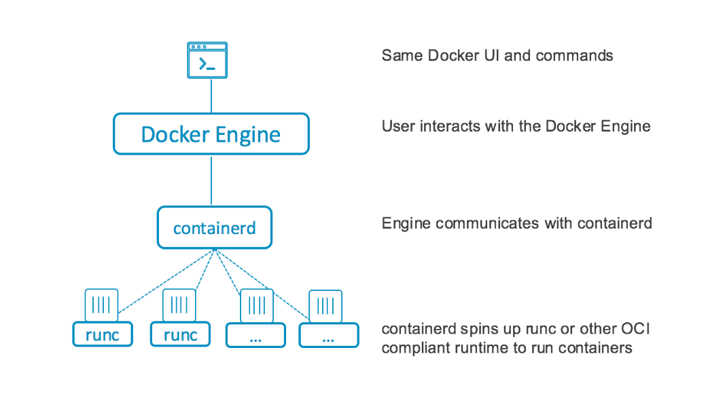

# 云计算实验指南

[toc]

---

## 实验一 Docker 的安装与使用

### 实验目的

- 了解 Docker 的用途、基本运行原理
- 掌握 Docker 的常见使用方式
- 了解 Docker 的部分高级应用
- 了解 Dockerfile 的用法以及基本结构
- 学习如何构建并部署自己的容器

### 容器简介

### 容器

对于当今的绝大多数 PaaS 来说，容器（_container_）技术都是必不可少的底层技术之一。容器本质上是 **受到资源限制、彼此相互隔离的** 一组进程。相比于“容器”，container 的另一个意思——集装箱更符合容器的含义。将货物装在统一的格式的集装箱中，能够层层堆叠，便于运输和管理。容器就是装载应用的集装箱。一方面，应用软件及其依赖的环境（环境变量、库等）会集成到容器中，使得应用可以正常运行，服务可以正常提供；另一方面，容器之间又会有明确的边界，应用之间不会相互干扰。容器中没有独立的操作系统，而是都共享宿主机的操作系统内核，因此与虚拟机相比，容器十分轻量化。


举个例子，我们可以在宿主上同时运行两个相同镜像的容器，它们都是在一个 ubuntu 镜像上构建的 Nginx 服务器，我们给它们分别取名为`nginx1`和`nginx2`：

```
root@ubuntu:~# docker run --name nginx1 -d ubuntu/nginx
56fee1b59ecafdf305d8eccf06041dbdcbf6466a281631a3d439f2a45d4f5c69
root@ubuntu:~# docker run --name nginx2 -d ubuntu/nginx
0d7a20b271d0cfb0d911e417f965da1aa59b02808886c12883339a06602048cc
```

紧接着，在宿主环境中使用`ps`查看进程的变化情况：

```
root@ubuntu:~# ps -ejf
UID          PID    PPID    PGID     SID  C STIME TTY          TIME CMD

......

root     1384767       1 1384767    1083  0 13:00 ?        00:00:00 /usr/bin/containerd-shim-runc-v2 -namespace moby -id 56fee1b59ecafdf305d8eccf06041dbdcbf6466a281631a3d439f2a45d4f5c6
root     1384790 1384767 1384790 1384790  0 13:00 ?        00:00:00 nginx: master process nginx -g daemon off;
www-data 1384852 1384790 1384790 1384790  0 13:00 ?        00:00:00 nginx: worker process
www-data 1384853 1384790 1384790 1384790  0 13:00 ?        00:00:00 nginx: worker process
www-data 1384854 1384790 1384790 1384790  0 13:00 ?        00:00:00 nginx: worker process
www-data 1384855 1384790 1384790 1384790  0 13:00 ?        00:00:00 nginx: worker process
www-data 1384856 1384790 1384790 1384790  0 13:00 ?        00:00:00 nginx: worker process
www-data 1384857 1384790 1384790 1384790  0 13:00 ?        00:00:00 nginx: worker process
www-data 1384858 1384790 1384790 1384790  0 13:00 ?        00:00:00 nginx: worker process
www-data 1384859 1384790 1384790 1384790  0 13:00 ?        00:00:00 nginx: worker process
www-data 1384860 1384790 1384790 1384790  0 13:00 ?        00:00:00 nginx: worker process
www-data 1384861 1384790 1384790 1384790  0 13:00 ?        00:00:00 nginx: worker process
www-data 1384862 1384790 1384790 1384790  0 13:00 ?        00:00:00 nginx: worker process
www-data 1384863 1384790 1384790 1384790  0 13:00 ?        00:00:00 nginx: worker process
root     1384927       1 1384927    1083  0 13:00 ?        00:00:00 /usr/bin/containerd-shim-runc-v2 -namespace moby -id 0d7a20b271d0cfb0d911e417f965da1aa59b02808886c12883339a06602048c
root     1384948 1384927 1384948 1384948  0 13:00 ?        00:00:00 nginx: master process nginx -g daemon off;
www-data 1385006 1384948 1384948 1384948  0 13:00 ?        00:00:00 nginx: worker process
www-data 1385007 1384948 1384948 1384948  0 13:00 ?        00:00:00 nginx: worker process
www-data 1385008 1384948 1384948 1384948  0 13:00 ?        00:00:00 nginx: worker process
www-data 1385009 1384948 1384948 1384948  0 13:00 ?        00:00:00 nginx: worker process
www-data 1385010 1384948 1384948 1384948  0 13:00 ?        00:00:00 nginx: worker process
www-data 1385011 1384948 1384948 1384948  0 13:00 ?        00:00:00 nginx: worker process
www-data 1385012 1384948 1384948 1384948  0 13:00 ?        00:00:00 nginx: worker process
www-data 1385013 1384948 1384948 1384948  0 13:00 ?        00:00:00 nginx: worker process
www-data 1385014 1384948 1384948 1384948  0 13:00 ?        00:00:00 nginx: worker process
www-data 1385015 1384948 1384948 1384948  0 13:00 ?        00:00:00 nginx: worker process
www-data 1385016 1384948 1384948 1384948  0 13:00 ?        00:00:00 nginx: worker process
www-data 1385017 1384948 1384948 1384948  0 13:00 ?        00:00:00 nginx: worker process

......

```

显然，**与虚拟机不同，在宿主中我们可以清晰看到容器中启动了哪些进程** ：1 个 Nginx master 进程和其生出的多个 Nginx 工作子进程。**和宿主中原来的进程一样，这些进程都会直接被宿主的内核调度，共享着宿主的 CPU、内存、带宽等资源。** 值得注意的是，这两个 Nginx master 进程的父进程都是一个 containerd 相关进程。

紧接着分别进入两个容器中，查看它们内部包含的进程：

```
root@ubuntu:~# docker exec -it nginx1 /bin/bash
root@56fee1b59eca:/# ps -ejf
UID          PID    PPID    PGID     SID  C STIME TTY          TIME CMD
root           1       0       1       1  0 05:00 ?        00:00:00 nginx: master process nginx -g daemon off;
www-data      19       1       1       1  0 05:00 ?        00:00:00 nginx: worker process
www-data      20       1       1       1  0 05:00 ?        00:00:00 nginx: worker process
www-data      21       1       1       1  0 05:00 ?        00:00:00 nginx: worker process
www-data      22       1       1       1  0 05:00 ?        00:00:00 nginx: worker process
www-data      23       1       1       1  0 05:00 ?        00:00:00 nginx: worker process
www-data      24       1       1       1  0 05:00 ?        00:00:00 nginx: worker process
www-data      25       1       1       1  0 05:00 ?        00:00:00 nginx: worker process
www-data      26       1       1       1  0 05:00 ?        00:00:00 nginx: worker process
www-data      27       1       1       1  0 05:00 ?        00:00:00 nginx: worker process
www-data      28       1       1       1  0 05:00 ?        00:00:00 nginx: worker process
www-data      29       1       1       1  0 05:00 ?        00:00:00 nginx: worker process
www-data      30       1       1       1  0 05:00 ?        00:00:00 nginx: worker process
root          49       0      49      49  1 05:16 pts/0    00:00:00 /bin/bash
root          57      49      57      49  0 05:16 pts/0    00:00:00 ps -ejf
```

```
root@ubuntu:~# docker exec -it nginx2 /bin/bash
root@0d7a20b271d0:/# ps -ejf
UID          PID    PPID    PGID     SID  C STIME TTY          TIME CMD
root           1       0       1       1  0 05:00 ?        00:00:00 nginx: master process nginx -g daemon off;
www-data      18       1       1       1  0 05:00 ?        00:00:00 nginx: worker process
www-data      19       1       1       1  0 05:00 ?        00:00:00 nginx: worker process
www-data      20       1       1       1  0 05:00 ?        00:00:00 nginx: worker process
www-data      21       1       1       1  0 05:00 ?        00:00:00 nginx: worker process
www-data      22       1       1       1  0 05:00 ?        00:00:00 nginx: worker process
www-data      23       1       1       1  0 05:00 ?        00:00:00 nginx: worker process
www-data      24       1       1       1  0 05:00 ?        00:00:00 nginx: worker process
www-data      25       1       1       1  0 05:00 ?        00:00:00 nginx: worker process
www-data      26       1       1       1  0 05:00 ?        00:00:00 nginx: worker process
www-data      27       1       1       1  0 05:00 ?        00:00:00 nginx: worker process
www-data      28       1       1       1  0 05:00 ?        00:00:00 nginx: worker process
www-data      29       1       1       1  0 05:00 ?        00:00:00 nginx: worker process
root          39       0      39      39  0 05:15 pts/0    00:00:00 /bin/bash
root          48      39      48      39  0 05:15 pts/0    00:00:00 ps -ejf
```

与宿主中不同，在容器内部，我们只看到了几个光秃秃的 Nginx 进程，并且 Nginx master 进程无一例外都变成了容器的 1 号进程。这是因为容器成功的将容器内的进程与宿主中的进程、不同容器之间的进程进行了隔离，每个容器内的进程都只能看到同属于本容器的资源。

Linux 中容器的实现，依赖于 Linux 内核提供的 namespace 和 cgroups 能力。其中，namespace 负责隔离不同容器之间的进程号、文件系统、网络等等，而 cgroups 负责限制容器内进程对资源（如 CPU、内存等）的使用。对容器技术感兴趣的同学可以自行深入学习相关内容，这里就不详细展开了。

同样地，因为容器本身只不过是宿主中的隔离起来的一组进程，与宿主共享内核，所以宿主只能运行与其内核相同的容器。比如，Linux 上无法运行 Windows 容器，同样地，Windows 或者 macOS 上如果想要运行 Linux 容器的话，必须借助虚拟机来进行，实际上，Docker Desktop 也是这样做的。

#### 容器运行时与 Docker

容器运行时（container runtime）指的是那些工作在底层的负责维护容器生命周期的程序，它们负责设置 namespace 和 cgroups、执行相应命令以启动进程等等，这些程序包括[rkt](https://coreos.com/rkt/)、[lxc](https://linuxcontainers.org/)、[runc](https://github.com/opencontainers/runc)等等。上层的容器引擎一般以它们为基础，用来屏蔽不同系统的容器运行时的底层差异，提供更高级更易用的接口，典型的比如[containerd](https://containerd.io/)，它一般使用 runc 作为自己底层的容器运行时。


Docker 是一个更上层、功能更全面的容器引擎，它建构在 containerd 之上，额外提供了容器的网络管理、存储卷，甚至集群管理等功能，并且提供了一套容器镜像标准和自定义容器镜像的工具，让容器技术变得更简单易用。因此，相比于其他底层技术，Docker 更广为人知，甚至已经成为了“容器”的代名词。



### Docker 简介

> Docker 是一个开源的应用容器引擎，让开发者可以打包他们的应用以及依赖包到一个可移植的镜像中，然后发布到任何流行的 Linux 或 Windows 机器上，也可以实现虚拟化。容器是完全使用沙箱机制，相互之间不会有任何接口。

### 安装 Docker

> **分发给大家的虚拟机已经安装好了 Docker，使用实验虚拟机进行实验无需进行本步操作。**

如前所述，在 Windows 和 macOS 上运行 Docker 容器的方法是借助虚拟机实现的，因此，如果想在本地使用 Docker 的话，建议安装在本地的 Linux 虚拟机中进行；当然你可以使用 Docker 官网提供的 Docker Desktop，但可能会遇到一些莫名其妙的问题。

**请务必仔细阅读[Docker 官方文档](https://docs.docker.com/engine/install/)来完成安装。** 下面仅给出简单的操作步骤。

#### 使用脚本安装

> 推荐使用此种安装方式

```bash
curl -fsSL https://get.docker.com -o get-docker.sh
sudo sh get-docker.sh
```

#### 从仓库中安装

- 更新已有的包，避免之后出现问题 `sudo apt-get update`

- 安装所需组件 `apt-get install apt-transport-https ca-certificates curl software-properties-common -y`

- 添加 Docker 源

  ```bash
  curl -fsSL https://download.docker.com/linux/ubuntu/gpg | apt-key add -
  add-apt-repository "deb [arch=amd64] https://download.docker.com/linux/ubuntu $(lsb_release -cs) stable"
  apt update
  ```

- 安装 Docker

  ```bash
  apt install docker-ce
  ```

- 验证 Docker 是否成功安装

  ```bash
  docker -v
  Docker version 18.06.3-ce, build d7080c1
  ```

#### 允许非 root 用户访问

默认情况下，只有 root 用户才有权限访问 Docker 引擎。如果你想让非 root 用户也可以使用 Docker，需要将用户加入`docker`用户组：

```bash
sudo usermod -aG docker <your-user>
```

这一操作一般需要用户注销后重新登录才会生效。

### Docker 的基本使用

#### 第一个 Docker 应用

> 本节以安装、运行一个 Docker 的 UI 管理平台为例。

- 下载镜像 `docker pull docker.scs.buaa.edu.cn/portainer/portainer`，成功后会显示`{docker_id}: Pull complete`,其中`{docker_id}`为镜像在本地的 ID。

  ```
  root@ubuntu:~# docker pull docker.scs.buaa.edu.cn/portainer/portainer
  Using default tag: latest
  latest: Pulling from portainer/portainer
  94cfa856b2b1: Pull complete
  49d59ee0881a: Pull complete
  a2300fd28637: Pull complete
  Digest: sha256:e65d695a05c6b0c9e6fb825e0b13ae92e7fe3f4673fe2aba247ca4b585952be7
  Status: Downloaded newer image for docker.scs.buaa.edu.cn/portainer/portainer:latest
  docker.scs.buaa.edu.cn/portainer/portainer:latest
  ```

- 查看镜像列表 `docker images` 或 `docker image ls`

  ```
  root@ubuntu:~# docker image ls
  REPOSITORY                                   TAG       IMAGE ID       CREATED         SIZE
  docker.scs.buaa.edu.cn/portainer/portainer   latest    580c0e4e98b0   3 weeks ago     79.1MB
  ```

> **注意**
>
> 实验虚拟机中可能已经有了一些其他的镜像，这些镜像在之后的实验中会用到，**不要**删除这些镜像，也不要修改、运行。

- 启动容器运行该镜像
  `docker run -d -p 9000:9000 -p 8000:8000 --name portainer --restart always -v /var/run/docker.sock:/var/run/docker.sock -v portainer_data:/data portainer/portainer`
- 现在，该管理平台已经运行在 docker 中，可以通过 9000 端口进行访问并设置密码。

  

- 连接方式选择`local`

  

- 在主机中查看容器列表 `docker container ls` 或 `docker ps`

  > 注意：`docker ps`命令只会显示正在运行的容器，若想查看所有容器，则要使用`docker ps -a`命令

  ```
  CONTAINER ID   IMAGE                                        COMMAND                  CREATED          STATUS          PORTS                                            NAMES
  fcab4844be6d   docker.scs.buaa.edu.cn/portainer/portainer   "/portainer"             30 seconds ago   Up 29 seconds   0.0.0.0:8000->8000/tcp, 0.0.0.0:9000->9000/tcp   portainer
  ```

> 注意：
>
> - 如果使用云服务器，请检查服务器防火墙设置（包括操作系统防火墙，以及云服务提供商的防火墙）。并且不推荐将端口设置为 80、443 等 HTTP 默认端口，在未备案的情况下，云服务提供商一般不会提供这两个端口的 HTTP 访问。
> - 如果使用本地虚拟机，本地访问时直接使用虚拟机 IP 即可。跨设备访问（比如使用另一台电脑/手机访问）时，需要将网络设置为 NAT 模式，访问时需访问物理机的 IP 及 NAT 设置的端口。

下面，我们将以刚刚下载镜像并启动第一个容器的命令为例，说明 `docker` 命令的基本用法。

#### docker pull

> [_Docker Hub_](https://hub.docker.com)是 Docker 官方维护的公共镜像仓库，现在已经有了超过 300 万个镜像。它的功能与*Github*类似，你可以将自己的 Docker 上传至*Docker Hub*分享给其他人，也可以下载使用其他人的开源 Docker 镜像，避免重复造轮子。

用法：

`docker pull [OPTIONS] NAME[:TAG|@DIGEST]`

与`git pull`类似，`docker pull`后添加需要下载的镜像名即可将镜像下载至本地。一般地，镜像名完整格式为`{镜像仓库地址}/{用户名}/{镜像名}:TAG`。

例如本例中使用的 `docker.scs.buaa.edu.cn/portainer/portainer` ，其中：

- `docker.scs.buaa.edu.cn`为进行仓库地址，用来告诉 docker 去哪里 pull 这个镜像；

- 第一个`portainer`表示用户名，即这个镜像是属于谁的；

- 第二个`portainer`表示镜像的名称；

- 最后，我们还可以使用`TAG`来指定需要获取的镜像的版本，但在`docker.scs.buaa.edu.cn/portainer/portainer`没有指定，那么默认`TAG`为`latest`。即`docker pull docker.scs.buaa.edu.cn/portainer/portainer` 与 `docker pull docker.scs.buaa.edu.cn/portainer/portainer:latest` 是等价的。

同样地，镜像仓库地址和用户名也都是可以省略的，如果省略镜像仓库地址，那么默认为`docker.io`；如果用户名省略，那么默认为`library`。总之，下面两种写法是等价的：`docker pull ubuntu` 和 `docker pull docker.io/library/ubuntu:latest`。

对于其他部分常用的操作系统（如 CentOS）、编程语言运行时（如 Java）、数据库（如 MySQL）等，Docker 官方提供了一系列官方镜像存储库（_Docker Official Images_）。在下载这些存储库时，无需添加作者名，直接添加镜像名即可（尽管它们实际上也在`library`名下），如`docker pull mysql`。

> 由于*Dokcer Hub*服务器速度受限，在下载较大镜像时速度很慢，因此最好使用国内的 Docker 镜像源。执行如下命令即可更换 Docker 镜像源并重启 Docker：
>
> ```command
> mkdir -p /etc/docker
> tee /etc/docker/daemon.json <<-'EOF'
> {
>  "registry-mirrors": ["https://docker.mirrors.ustc.edu.cn"]
> }
> EOF
> systemctl daemon-reload
> systemctl restart docker
> ```
>
> 其中，`registry-mirrors`中镜像地址可以也替换成其它的地址。
>
> 一些 Docker 镜像地址：
>
> - Docker 中国官方镜像 `https://registry.docker-cn.com`
> - 中科大 Docker 镜像 `https://docker.mirrors.ustc.edu.cn`
> - 微软 Azure 镜像 `https://dockerhub.azk8s.cn`
>
> 如果 Docker 部署在云服务器上，使用云提供商的镜像加速器速度会有飞跃性的提升。以阿里云提供的镜像加速器为例，在[容器镜像服务](https://www.aliyun.com/product/acr)中进入管理控制台，登录后即可在左侧镜像加速器一栏中查看镜像地址。

对于镜像的搜索，可以在[_Docker Hub_ 官网](https://hub.docker.com)搜索，也可以使用`docker search`命令。例如搜索 MySQL 镜像：

```command
root@roycent-Ali2:~# docker search mysql
NAME                              DESCRIPTION                                     STARS               OFFICIAL            AUTOMATED
mysql                             MySQL is a widely used, open-source relation…   9110                [OK]
mariadb                           MariaDB is a community-developed fork of MyS…   3218                [OK]
mysql/mysql-server                Optimized MySQL Server Docker images. Create…   674                                     [OK]
```

#### docker run

对于一般的用户，`docker run`命令是最常用也是最复杂的命令之一。`docker run`命令用于创建并运行容器。完整的命令参数及用法参见[Docker 官方文档](https://docs.docker.com/engine/reference/commandline/run/)，下面仅以刚刚执行过的`docker run`命令为例，说明部分常用的参数意义。

用法：
`docker run [OPTIONS] IMAGE [COMMAND] [ARG...]`

> 注意：将参数放在需要启动的镜像名前，以免引起不必要的错误。如，应使用`docker run -v /var/run/docker.sock:/var/run/docker.sock portainer`，**而不是**`docker run portainer -v /var/run/docker.sock:/var/run/docker.sock`

- `-d`
  - `--detach`，以后台模式运行容器并打印容器 ID。类似于 Linux 命令中的`nohup {command} &`。一般情况下，运行服务都会添加此参数，否则容器会在前台运行。
- `-p`
  - `--publish`，将容器的端口发布至主机，与端口映射相似。`:`前为使用的主机端口，`:`后为容器的端口，二者可以不同，即可以将容器中的一个端口映射至主机的任一未占用端口。
- `--name`
  - 容器的名字，即在`docker ps`中查看到的`NAMES`，方便辨识容器。如果不指定此参数，Docker 会随机生成一个名字。
- `-v`
  - 绑定的外部数据集。`:`前为主机中的文件或路径，`:`后的为容器中的文件或路径。需要存储数据或者使用主机中资源的容器需要设置该参数。在刚刚执行过的`docker run`命令中，由于要通过该平台管理 docker，因此要将 docker 接收 socket 请求的`docker.sock`路径传入容器；同时，为了方便数据的管理、备份以及数据安全，将容器中的数据存储到容器外，即`portainer_data`文件夹中。需要注意的是，本例中填写的路径是相对路径，数据会存储在 docker 安装路径下的`volumes`文件夹中。默认的安装路径是`/var/lib/docker`，即本例中数据会存储在`/var/lib/docker/volumes/portainer_data`中。
- `--restart`
  - 容器的重启策略，通常与`-d`参数一起使用。默认选项为`no`。`docker run`在退出时会产生一系列状态码，例如 0 为正常退出、127 为容器调用的命令不存在等。这个参数控制了容器退出（包括正常退出、遇到错误退出）时，是否进行重启。本例中使用的`always`选项策略，为无论容器因何退出，都将重启以保证服务的正常运行。
- `-e`
  - 容器的环境变量。某些容器需要指定初始的参数来保证应用的正常运行，例如 MySQL 容器在启动时需要指定初始密码（或设置为允许空密码、自动生成随机密码）来保证 MySQL 的访问及安全：`docker run -e MYSQL_ROOT_PASSWORD=@buaa21 mysql`

> Docker 在运行“服务类容器”（如 MySQL、Nginx 等）之外，还可能会运行“工作类容器”（某些一次性或有限次执行的脚本等）。

#### docker exec

> 本节使用 MySQL 容器为例，在学习`exec`命令前要拉取并运行 MySQL 容器：
>
> ```command
> docker pull docker.scs.buaa.edu.cn/library/mysql
> docker run -d -e MYSQL_ROOT_PASSWORD=@buaa21 -p 8006:3306 --name mysql docker.scs.buaa.edu.cn/library/mysql
> ```

`docker exec`命令用于在容器中执行命令。
用法：
`docker exec [OPTIONS] CONTAINER COMMAND [ARG...]`
其含义为：在容器 CONTAINER 中，执行命令 COMMAND \[ARG...]

- 查看 mysql 容器中 home 文件夹中的文件（在 mysql 容器中执行`ls /root`）
  `docker exec mysql ls /root`
  由于 home 文件夹中没有文件，该命令没有输出
- 在 mysql 容器的 home 文件夹中创建文件
  `docker exec mysql touch /root/test_exec.tmp`
- 再次查看容器中 home 文件夹中的文件
  `docker exec mysql ls ~`
  可以查看到新建的文件，说明命令执行成功

  ```command
  root@roycent-Ali2:~# docker exec mysql ls ~
  test_exec.tmp
  ```

- 对于更加复杂的指令，可以调用容器中的 bash 来执行

  - `docker exec mysql /bin/bash`
    然而，执行这句命令之后不会有任何输出，也不会要求继续输入。正确的命令应该为：
  - `docker exec -it mysql /bin/bash`

    ```command
    root@roycent-Ali2:~# docker exec -it mysql /bin/bash
    root@24c575abf8ed:/#
    ```

  这样，就相当于进入了容器内部，可以像在一般 Linux 设备中执行命令。在本例中，可以用此方法管理 MySQL 数据库：

  - `mysql -uroot -p`

  ```command
  root@24c575abf8ed:/# mysql -uroot -p
  Enter password:
  Welcome to the MySQL monitor.  Commands end with ; or \g.
  ```

> 要退出容器 bash 时，输入`exit`命令即可

- `-i`参数
  - `--interactive`，即使没有连接，也保持容器的标准输入打开。不加`-i`参数时，如果没有输入流衔接，bash 就会关闭。
- `-t`参数
  - `--tty`，分配一个“冒充的”终端设备。与`-i`结合使用，就会达到产生一个模拟终端，并保持正常交互的作用。
- `-d`参数
  - `--detach`，与`run`命令中的`-d`参数类似，这里的`-d`参数也是将命令在后台运行。

#### 常用 docker 命令

[Docker CLI 文档](https://docs.docker.com/engine/reference/commandline/docker/)中包含了更加详细和全面的 docker 命令用法。

- 容器生命周期管理
  - run：创建并启动容器
  - start/stop/restart：启动/停止/重启容器
  - kill：杀掉容器
  - rm：删除容器
  - pause/unpause：暂停运行/恢复运行容器
  - create：创建容器（但不启动）
  - exec：在容器中执行命令
- 容器管理操作
  - ps：列出本地容器
  - inspect：查看容器或镜像的元数据
  - top：查看容器中正在运行的进程信息
  - attach：连接到正在运行中的容器
    - 由于一般容器都以守护态后台运行，无法通过 attach 命令进入容器，常用进入容器的命令为`exec -it CONTAINER /bin/bash`
  - logs：获取容器日志
  - wait：阻塞运行直到容器停止，然后打印出它的退出代码
  - export：将文件系统作为一个 tar 归档文件导出
  - port：列出指定容器的端口映射
  - system
    - system df：查看磁盘使用情况
    - system events：查看实时事件
    - system info：查看 docker 系统信息
    - system prune：删除无用数据
  - stats：查看各个容器的运行状态
- 容器 rootfs 操作
  - commit：从容器创建一个新的镜像
  - cp：在容器与主机之间拷贝数据
  - diff：检查容器里文件结构的更改
- 容器镜像仓库操作
  - login/logout：登录/登出 Docker 镜像仓库，默认为 Docker Hub
  - pull：拉取/更新镜像
  - push：将镜像上传到镜像仓库
  - search：从 Docker Hub 查找镜像
- 本地镜像管理
  - images：列出本地镜像
  - rmi：删除本地镜像
  - tag：标记本地镜像，将其归入某一仓库
  - build：使用 Dockerfile 创建镜像
  - history：查看镜像的创建历史
  - save：将镜像保存成 tar 归档文件
  - load：导入镜像的 tar 归档文件
  - import：从归档文件中创建镜像
- 容器信息查看
  - version：查看容器版本信息

### 构建定制镜像

#### Dockerfile

> Dockerfile 是一个用来构建镜像的文本文件，文件中包含了一条条构建镜像所需的指令和说明。本节使用一个的 Nginx 镜像，运行一个简单的 HTML 网页来说明 Dockerfile 如何工作。官方文档提供的[Dockerfile 最佳实践](https://docs.docker.com/develop/develop-images/dockerfile_best-practices/)会提供更多有用的细节。

- 编写 Dockerfile

  ```Dockerfile
  FROM docker.scs.buaa.edu.cn/library/nginx
  RUN echo 'This is an Nginx running in a container built by me.' > /usr/share/nginx/html/index.html
  ```

- Dockerfile 文件的构成

  - 详细用法参见[Dockerfile reference](https://docs.docker.com/engine/reference/builder/)
  - FROM：定制的镜像基于 FROM 的镜像。在本例中，基础镜像为 Nginx 镜像，后续对镜像的更改都是在 Nginx 镜像基础上操作的。
  - RUN：在构建时执行命令。

    > 提示：由于 Dockerfile 的每条指令都会在 docker 上新建一层，如果一条或多条指令会产生不需要的缓存文件（比如编译带来的临时文件、下载的代码或安装包、其他缓存等），最好将几条命令用`&&`连在一起，从而减少资源占用。例如，使用:
    >
    > ```Dockerfile
    > RUN apt-get update && apt-get install -y \
    >     package-a \
    >     package-b
    > ```
    >
    > **而不是**：
    >
    > ```Dockerfile
    > RUN apt-get update
    > RUN apt-get install -y package-a
    > RUN apt-get install -y package-b
    > ```

  - COPY：将文件或文件夹在上下文路径及制定路径间复制。用法为 `COPY {SRC} {DST}`，其中 SRC、DST 分别为源路径、目标路径。
  - ADD：与 COPY 功能和用法类似，ADD 会在复制压缩文件时自动解压缩。
  - CMD：在运行时执行命令
  - ENTRYPOINT：配置容器启动后执行的命令。
  - ENV：定义环境变量。
  - ARG：定义只在构建时有效的环境变量。
  - VOLUME：定义匿名数据卷。
  - EXPOSE：声明端口。
  - WORKDIR：指定工作目录。
  - USER：用于指定执行命令的用户和用户组。
  - HELTHCHECK：用于指定某个程序或指令来监控容器的运行状态。
  - ONBUILD：用于延迟构建命令的执行，即仅在镜像被引用(FROM)时才会被执行。

#### 使用 Dockerfile 构建镜像

- 构建镜像

  - `docker build -t nginx:hello_docker .`

  > 注意：命令后面有一个`.`，其作用稍后会介绍到。

- 查看构建的镜像

  - `docker images`

- 构建结果（省略了部分输出）：

  ```command
  root@roycent-Ali2:~/docker_hello# docker build -t nginx:hello_docker .
  Sending build context to Docker daemon  2.048kB
  Step 1/2 : FROM nginx
  latest: Pulling from library/nginx
  Status: Downloaded newer image for nginx:latest
   ---> 2073e0bcb60e
  Step 2/2 : RUN echo 'This is an Nginx running in a container built by me.' > /usr/share/nginx/ html/index.html
  Successfully built 15c3b8a0b503
  Successfully tagged nginx:hello_docker
  root@roycent-Ali2:~/docker_hello# docker images
  REPOSITORY            TAG                 IMAGE ID            CREATED              SIZE
  nginx                 hello_docker        15c3b8a0b503        About a minute ago   127MB
  ```

- 运行构建的镜像
  - `docker run -p 8008:80 -d nginx:hello_docker`
    > 注意：不要将镜像的 tag 落下，否则运行的将是不是自己构建的镜像。
- 访问端口查看是否成功
  

- 构建时用到的命令
  - `-t`参数
    - `--tag`，将容器以“名字：标签”格式命名
  - `.`
    - `.`为上下文路径。构建时需要将指定目录中的文件一起打包给 Docker 引擎使用。如果未说明最后一个参数，默认上下文路径就是 Dockerfile 所在位置。由于 Docker 引擎会将路径下的所有内容打包，因此这个路径中最好不要放与当前 Docker 无关的文件。

#### 使用已存在的容器构建镜像

> 很多时候我们可能不会直接编写 Dockerfile 来构建镜像，而是拉取并运行已存在的镜像，对容器进行修改。以前文已经创建好的 MySQL 容器为例：

- 将对容器的修改保存为镜像`docker commit mysql mysql:commit_mysql`

  ```command
  root@roycent-Ali2:~# docker commit mysql mysql:commit_mysql
  sha256:9e95e78c0f62e656a33ea37c6c11edf9ccc47847f6d974bfdd71f64f319e0be0
  root@roycent-Ali2:~# docker images
  REPOSITORY             TAG                 IMAGE ID            CREATED              SIZE
  mysql                  commit_mysql        9e95e78c0f62        3 seconds ago        465MB
  ```

#### 上传镜像

> 进行本节实验之前，需要在[Docker Hub](https://hub.docker.com/)注册一个自己的账号。

- 登录 Docker Hub 账号

  - `docker login`

  ```command
  root@roycent-Ali2:~# docker login
  Login with your Docker ID to push and pull images from Docker Hub.
  Username: roycent
  Password:
  Login Succeeded
  ```

- 上传在之前制作好的`hello_docker`镜像
  - `docker push nginx:hello_docker`
  - 然而，这样是无法上传的，会显示`denied: requested access to the resource is denied`。由于 nginx 镜像实际上是`library/nginx`镜像，直接 push 上传到的是这个官方库，没有权限上传就无法上传成功。
- 更改镜像标签
  - `docker tag nginx:hello_docker {username}/hello_world`
  - 其中，将`username`替换为已经登录的 Docker Hub 账号
- 再次上传镜像，就可以在 Docker Hub 上查看到上传的镜像了

### Docker 原生提供的三大编排工具

> Docker Compose 与 Machine 和 Swarm 一起被称为 Docker 的“三剑客”，是 Docker 原生提供的三大编排工具。如今在容器编排领域，使用 Kubernetes 已经成为了主流，因此本节只做了解，不详细阐述这三大工具以及他们的使用。

#### Docker Compose

Compose 是用于定义和运行多容器 Docker 应用程序的工具。通过 Compose，可以使用 YAML 文件来配置应用程序的服务。然后，使用一个命令，就可以从配置中创建并启动所有服务。

#### Docker Swarm

Swarm 用于管理 Docker 集群，可以将 Docker 部署至多个主机中。

#### Docker Machine

Machine 是一种用于在虚拟主机上安装 Docker 引擎并管理主机的工具。使用 docker-machine 命令，可以启动、检查、停止和重启托管主机、升级或配置 Docker 客户端与守护程序。

### 动手做

> **请完整记录实验过程**

#### 复现前文的实验过程

1. 安装 Docker
2. 下载 portainer 镜像
3. 查看本地镜像列表
4. 运行 portainer 容器
5. 登录运行的 portainer 网站并查看 Dashboard 中的信息（使用 local 模式）
6. 使用命令行搜索 Docker Hub 中的任一镜像
7. 下载并安装 MySQL 镜像，并将数据库访问端口设置为 8006
8. 在 MySQL 容器中创建文件并查看结果
9. 在 MySQL 容器中执行命令并创建数据库
10. 将修改过的 MySQL 容器保存为镜像
11. 编写 Dockerfile，使用 Nginx 镜像显示一个静态网页，**网页内容添加上自己的学号**
12. 构建并运行新建的镜像
13. 将镜像上传至自己的 Docker Hub 中

#### 综合实验

编写一个 Dockerfile，使用其构建出一个镜像并运行，满足以下要求：

1. 基础镜像使用 Nginx 镜像
2. 将 Nginx 镜像中的`/usr/share/nginx/html/index.html`文件替换为`http://dockerlab.roycent.cn/lab1.html`文件
3. 在镜像的`/usr/share/nginx/html/`文件夹中添加一个`page.html`文件，其内容为自己的学号
4. 运行该镜像，虚拟机的 80 端口映射为将容器的 80 端口，访问、查看网页并记录网页内容
5. 将该镜像上传至自己的 Docker Hub 中

> 注意：
>
> - 1~3 步均通过 Dockerfile 中的命令完成，**不使用**docker 命令达成目的。记录实验过程时请附上 Docker Hub ID。
> - 添加的`page.html`文件包含学号即可，无需添加 HTML 标签。
> - 如果访问后显示 Nginx403，检查 index.html 文件的读权限是否设置正确。
