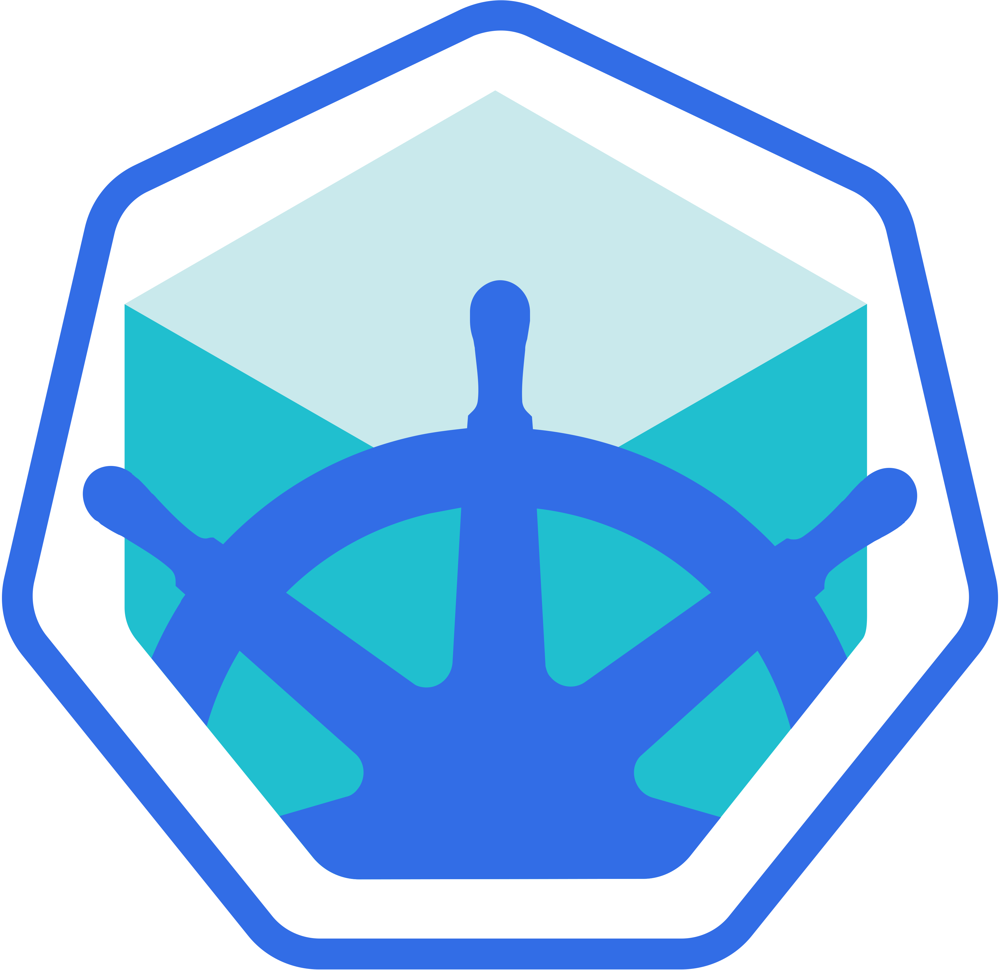
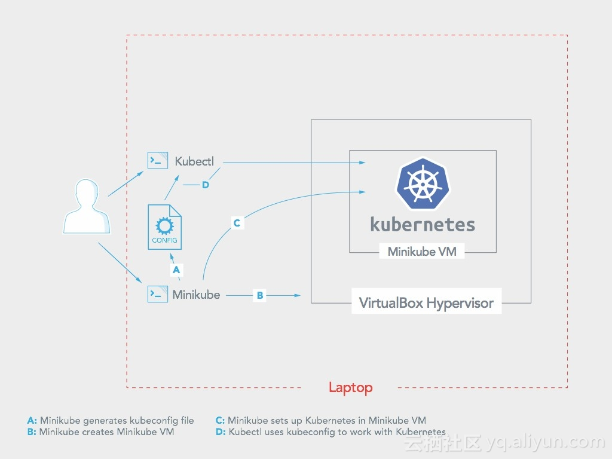
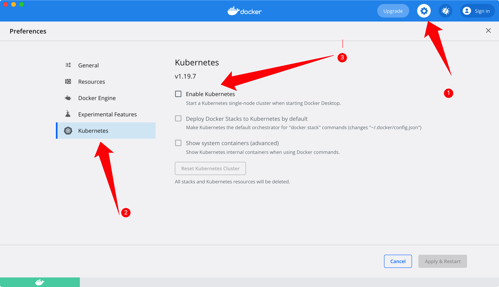
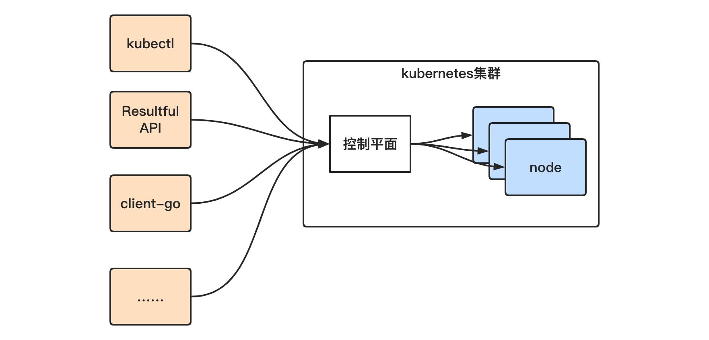
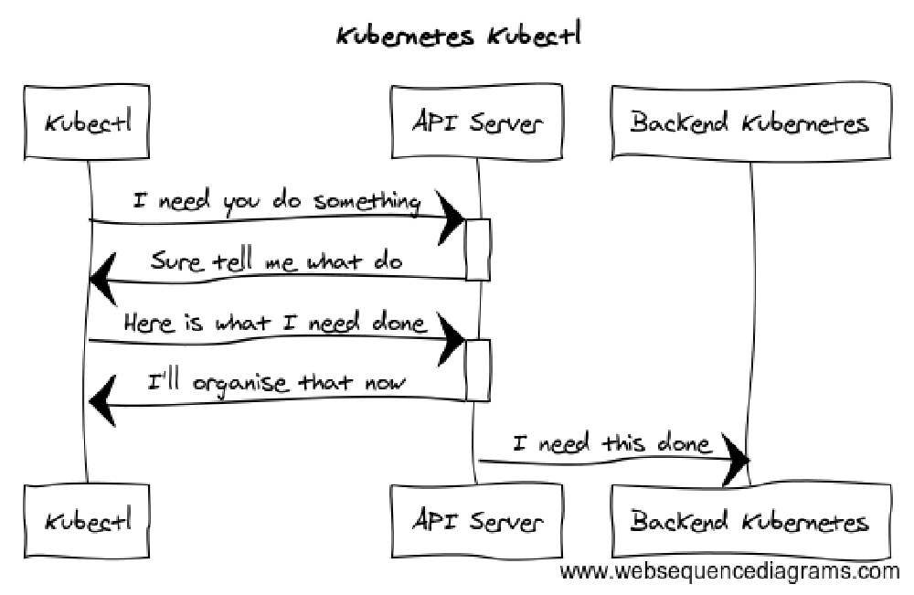
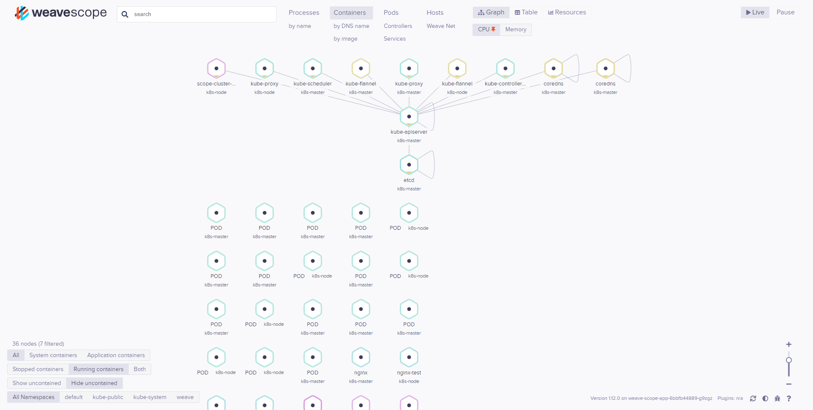
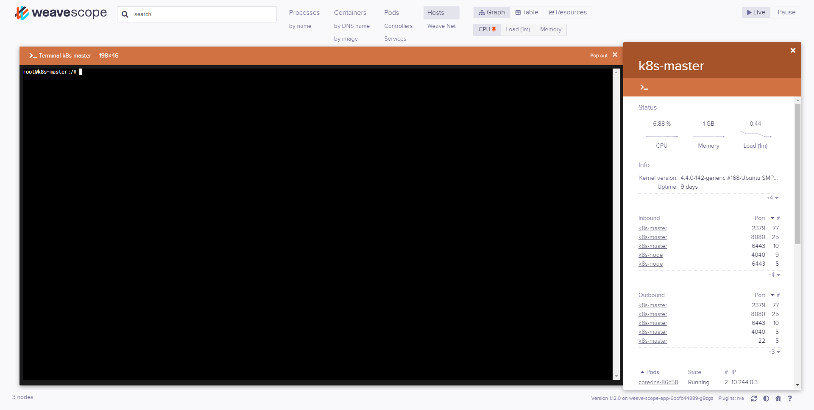

# 实验三 初识Kubernetes

[toc]

---

## 写在前面

由于实验涉及到集群的管理与应用，步骤较多，可能遇到的问题和引起问题的原因也较多。请大家在进行实验时仔细阅读实验手册，这些手册都是助教们一行一行写出来的。另外，常见问题总结在[这里](./FAQ.md)，遇到了问题可以先在这个页面上查找原因及解决办法，这个页面会根据大家的实验情况进行更新；如果你还有疑惑，请参阅[Kubernetes文档](https://kubernetes.io/zh/docs/home/)，在官方文档中可以获取最靠谱的解答。也建议大家在[这里](https://git.scs.buaa.edu.cn/iobs/cloud-labs/src/master/CCLab2-Kubernetes_Init.md)阅读html格式的实验报告，以减少转换为PDF的过程中因页面格式造成的阅读困扰。同时，建议大家提前进行实验，以免在deadline遇到难以解决的问题。**两个Kubernetes实验的内容含量差异较大，实验四内容较多，请合理安排使用时间**。

实验三和实验四最多只能帮大家入门，更深入的内容还需要大家阅读[Kubernetes文档](https://kubernetes.io/zh/docs/home/)，并且要多动手，多实践。

最后，祝大家顺利完成实验，在实验中学习到有用的知识。

## 实验目的

- 了解Kubernetes的用途、运行原理
- 了解Kubernetes的常见应用场景
- 掌握Kubernetes中的重要概念
- 掌握Kubernetes集群的基本构建方法

## Kubernetes简介

> [*Kubernetes*](https://kubernetes.io/)是用于自动部署，扩展和管理容器化应用程序的开源系统。

之前我们提到过在PaaS系统中容器的作用及重要性。容器给开发和部署服务带来了极大的便利，但同时也带了一些问题。比如，如何处理大规模容器的部署、伸缩、故障转移、负载均衡等等问题。这些问题似乎在小规模使用容器（比如完成一项课程设计或者搭建一个个人网站）时都可以得到较为妥善的解决（或者根本不需要解决，比如自己的网站挂了也不会有什么影响，多数时候重启一下恢复了），但是在实际的生产环境中，这些都是关系到企业能否提供高效可靠服务的关键所在。

*Kubernetes*在希腊语中的含义是船长/领航员，这个名字生动地体现了它在容器**集群**管理中的作用——调度和监控全局的集装箱（*container*，容器）。Kubernetes主要具有以下几点功能：

- 服务发现和负载均衡
- 存储编排
- 自动部署和回滚
- 自动二进制打包
- 自我修复
- 密钥与配置管理

> Kubernetes仅仅是一个容器编排和调度工具，其必须运行在“容器运行时（container runtime）”之上。Kubernetes定义了一套“容器运行时接口（CRI）”，凡是实现了这套接口的容器运行时都可以作为Kubernetes运行容器的后端。目前比较流行的有Containerd和CRI-O，从1.20版本开始，Kubernetes已经弃用Docker引擎作为容器运行时。

## Kubernetes架构、组件、重要概念

在开始使用Kubernetes之前，为了更加顺畅地理解接下来的操作，有一些概念需要提前了解。本节仅解释最基本的概念，而不会讲解详细逻辑、底层架构、解决方案、设计思想等等。另外的一些重要概念，会在涉及到的时候进行补充。

Kubernetes中的大部分概念，都可以被看作一种资源对象，我们对Kubernetes集群的各种操作，都可以看作是对各种资源进行增删改查的操作。

### Pod

Pod是Kubernetes中的基本执行单元，即管理、创建、计划的最小单元（而**不是**容器）。一个Pod中可以包含多个容器。在英文中，*pod*的意思是“豆荚”，豆荚和豆子的关系就类似于Pod和容器的关系。Pod内的各个容器共享网络和存储。比如可以使用localhost互相通信。

Pod的运行阶段(phase)是Pod在其生命周期中的简单宏观概述。phase可能的值会有：

- Pending：挂起。Pod已经被Kubernetes系统接受，但有一个或者多个容器镜像尚未创建。比如在调度Pod或者通过网络下载镜像时，可能会花费一定时间。在这个时候，Pod的状态就是Pending。
- Running：运行中。该Pod已经绑定到了一个节点上，Pod中所有的容器都已经被创建。至少有一个容器正在运行，或者正在处于重启或启动状态。
- Succeeded：成功。Pod中所有容器都被终止，并且不会再重启。
- Failed：失败。Pod中的所有容器都已终止了，并且至少有一个容器是因为失败终止。
- Unknown：未知。因为某些原因无法取得Pod的状态，通常是因为Pod与所在主机通信失败。

### Cluster

由于对故障转移、负载均衡等等功能的需要，容器往往不是运行在单一服务器上，而是运行在一个Cluster（集群）上。这也是Kubernetes诞生的重要原因之一。集群中会有很多的服务器（物理机或者虚拟机），这些服务器就被称为集群的节点（Node）。

### Node

Kubernetes一般都会运行在多个Node上，从而组成集群。Node是Pod真正运行的主机（这个主机既可以是物理机也可以是虚拟机）。Kubernetes并不会“创建”Node，而只是管理Node上的资源。在这些节点中会有负责管理集群的节点控制器，一般称之为master节点。在下文中，会以master节点代指运行节点控制器的节点，以普通节点或者node节点来代指其他节点。

### Service

在Kubernetes中，容器往往会频繁地重启或者销毁，如果按照Docker那样只用固定的IP地址和端口来访问不太现实。因此Kubernetes Service向外界提供了一种访问Pod的方式。Service有自己的IP地址和端口，同时也会为分配Pod的网络流量，达到负载均衡的效果。

### Namespace

Namespace用于将系统内部的对象划分为不同的组，实际上常用于隔离项目或者用户。比如Kubernetes自带服务一般运行在`kube-system`这个命名空间中。如果在创建Pod时不指定命名空间，创建出的Pod会存在于`default`这个命名空间中。我们在获取Pod列表时，如果不添加`--namespace`参数，则只会获取`default`命名空间中的Pod。

### Controller

一般情况下，Kubernetes通过控制器来管理Pod的生命周期。控制器用以监控集群的公共状态，并将当前的状态转变为期望的状态。比如，Controller中可能会定义Pod的部署属性：这个Pod有几个副本、在什么样的Node上运行等。Kubernetes提供了多种内置的控制器，比如Deployment、ReplicaSet、DaemonSet、StatefulSet、Job等等。当然，用户也可以编写自己的规则，来设计自己的专有控制器。

### Label

Label是Kubernetes中另一个核心概念。一个标签是一个`key=value`的键值对，其中key与value都由用户自己制定。Label可以被附加到各种资源对象上，比如刚刚提到的Node、Controller、Service等。我们可以通过给指定的资源对象捆绑一个或多个不同的Label来实现多维度的资源分组管理功能，以便灵活、方便地进行资源分配、调度、配置、部署等管理工作。Label的最常见的用法便是通过spec.selector来指定Label，从而Kubernetes寻找到所有包含你指定Label的对象、进行管理。也就是我们刚刚在配置文件中的用法。

## Kubernetes的安装

以下提供了几种部署Kubernetes集群的方式供大家根据自己的实际情况参考。

### 学习环境

在学习环境中，使用minikube或者Docker Desktop都是不错的选择，两者任选其一就好。

#### minikube

因为Kubernetes首先是一个集群，个人设备一般难以模拟真实的生产环境中的Kubernetes环境。在个人设备中，推荐使用[minikube](https://minikube.sigs.k8s.io/docs/start/)来体验、学习和使用Kubernetes集群。



minikube会在你的个人电脑上，启动一台虚拟机，并部署一个以该虚拟机为唯一节点的单节点Kubernetes集群。



注意，上图中的Virtual Box的虚拟环境是可选的，默认情况下使用Docker引擎就足够了。

一般来讲，minikube的安装和启动非常简单。只需要你安装好Docker之后（比如在macOS或Windows中，可以选择安装Docker Desktop），下载一个minikube的可执行文件，直接`minikube start`就好了。

但是，minikube在初始化时，需要拉取一些容器镜像，而这些镜像的地址因为某些原因无妨被正常访问。所以，可以曲线救国，使用阿里云的镜像，具体可以参考[这篇文章](https://developer.aliyun.com/article/221687)。

更多内容和使用方法请参考minikube官方给出的[教程和使用手册](https://minikube.sigs.k8s.io/docs/start/)。

#### Docker Desktop

如果在实验一中已经安装了Docker Desktop，那么可以直接使用Docker Desktop模拟启动一个Kubernetes集群。



如上图所示，打开Docker Desktop的控制面板，按照操作提示来就好。也可以参考[这篇文章](https://birthday.play-with-docker.com/kubernetes-docker-desktop/)。

### 生产环境

Kubernetes本身包含各个组件，纯靠人力完成部署是一件非常艰苦的工作。索性Kubernetes官方提供了很多安装引导工具来帮助我们搭建集群。**下面的部署方式，大家任选其一就好。**

#### Kubeadm

Kubeadm是一个Kubernetes集群部署引导工具。

> Kubeadm并不是Kubernetes集群的组成部分，它只是一个“外部工具”。

使用Kubeadm的方式部署集群，主要分为以下三个步骤：

- 在选定的master机器上[安装Kubeadm](https://kubernetes.io/zh/docs/setup/production-environment/tools/kubeadm/install-kubeadm/)这个二进制工具

- 随后执行`kubeadm init`，初始化master机器（此时集群中只有一台master机器），详细[参考](https://kubernetes.io/zh/docs/setup/production-environment/tools/kubeadm/create-cluster-kubeadm/)

- 在选定的node节点上，使用`kubeadm join`将该node节点加入集群

虽然上述步骤并不复杂，官方文档也足够详细，但因为某种原因，上述安装过程中需要使用的各种资源在国内几乎都无法正常下载。各种曲线救国的解决方案只会徒增问题的复杂性。因此，不是很推荐大家使用这种方式创建集群。当然，有兴趣的同学可以自行尝试。

实验课不是“环境部署课”，我们希望大家把精力更多地放在理解Kubernetes的核心概念上，而不是在环境部署方面浪费时间。因此，推荐使用下面的方式来完成Kubernetes集群的搭建。

#### K3s

[K3s](https://rancher.com/docs/k3s/latest/en/)是一个轻量的可用于生产环境的Kubernetes发行版，它默认使用Containerd作为容器运行时。在[K3s的GitHub主页](https://github.com/k3s-io/k3s)中，可以得到其详细的介绍。

下面将详细介绍一下如何搭建一个K3s集群。

## 准备工作

在实验三和实验四中，云平台给大家提供了两台虚拟机。因此，我们本次实验中搭建的集群将包含一个master节点和一个node节点。

### 修改hostname

Kubernetes要求集群中的各个节点的hostname各不相同，而云平台分配的机器的hostname统一都是ubuntu，所以这里需要修改一下。

分别登录两台机器，使用`hostnamectl`修改主机名：

```bash
sudo hostnamectl set-hostname ${new_name}
```

对于master节点，主机名格式为`k8s-master-${学号}`，对于node节点，主机名格式为`k8s-node-${学号}`。

修改完之后，可以使用`hostname -f`查看一下是否修改成功。

> 如果有强迫症，希望bash命令行前面的提示符也正常显示新的hostname，可以退出ssh，重新登录一下。

## 初始化master节点

云平台上的机器已经提前下载好了K3s所需的各种组件，直接使用k3s的安装脚本安装即可，并且，要选择**离线安装**的方式：

```bash
sudo INSTALL_K3S_SKIP_DOWNLOAD=true ./install.sh
```

完成后，大概有如下输出：

```
buaa@k8s-master:~$ sudo INSTALL_K3S_SKIP_DOWNLOAD=true ./install.sh
[sudo] password for buaa:
[INFO]  Skipping k3s download and verify
[INFO]  Skipping installation of SELinux RPM
[INFO]  Creating /usr/local/bin/kubectl symlink to k3s
[INFO]  Creating /usr/local/bin/crictl symlink to k3s
[INFO]  Creating /usr/local/bin/ctr symlink to k3s
[INFO]  Creating killall script /usr/local/bin/k3s-killall.sh
[INFO]  Creating uninstall script /usr/local/bin/k3s-uninstall.sh
[INFO]  env: Creating environment file /etc/systemd/system/k3s.service.env
[INFO]  systemd: Creating service file /etc/systemd/system/k3s.service
[INFO]  systemd: Enabling k3s unit
Created symlink /etc/systemd/system/multi-user.target.wants/k3s.service → /etc/systemd/system/k3s.service.
[INFO]  systemd: Starting k3s
```

使用`kubectl get node`可以看到已经master节点已经创建完成：

```
buaa@k8s-master:~$ sudo kubectl get node
NAME         STATUS   ROLES                  AGE     VERSION
k8s-master   Ready    control-plane,master   3m41s   v1.21.0+k3s1
```

## 将Node节点加入集群

登录node节点，确认修改完hostname后，在node节点执行以下命令。注意，请将命令中的`myserver`替换成自己master机器的ip，并将`mynodetoken`替换成自己集群的token（这个token值可以在master机器的`/var/lib/rancher/k3s/server/node-token`中找到。同样，请注意指定离线模式：

```bash
sudo INSTALL_K3S_SKIP_DOWNLOAD=true K3S_URL=https://myserver:6443 K3S_TOKEN=mynodetoken ./install.sh
```

完成后，大概有如下输出：

```
buaa@k8s-node:~$ sudo INSTALL_K3S_SKIP_DOWNLOAD=true K3S_URL=https://10.251.254.114:6443 K3S_TOKEN=K10bf9e0320c9073dfb7ce1ecbf116cdc8e58c755ef2a616cc98133d782dd3bb3f2::server:3777fd43d33dc8ff1b3cd321f41ccc24 ./install.sh
[sudo] password for buaa:
[INFO]  Skipping k3s download and verify
[INFO]  Skipping installation of SELinux RPM
[INFO]  Creating /usr/local/bin/kubectl symlink to k3s
[INFO]  Creating /usr/local/bin/crictl symlink to k3s
[INFO]  Creating /usr/local/bin/ctr symlink to k3s
[INFO]  Creating killall script /usr/local/bin/k3s-killall.sh
[INFO]  Creating uninstall script /usr/local/bin/k3s-agent-uninstall.sh
[INFO]  env: Creating environment file /etc/systemd/system/k3s-agent.service.env
[INFO]  systemd: Creating service file /etc/systemd/system/k3s-agent.service
[INFO]  systemd: Enabling k3s-agent unit
Created symlink /etc/systemd/system/multi-user.target.wants/k3s-agent.service → /etc/systemd/system/k3s-agent.service.
[INFO]  systemd: Starting k3s-agent
```

回到mater机器上，可以再次使用`kubectl get node`查看node节点是否加入成功，以及两台机器是否都已经处于Ready状态：

```
buaa@k8s-master:~$ sudo kubectl get node
NAME         STATUS   ROLES                  AGE     VERSION
k8s-node     Ready    <none>                 4m39s   v1.21.0+k3s1
k8s-master   Ready    control-plane,master   34m     v1.21.0+k3s1
```
至此，Kubernetes集群搭建完成。

## kubectl

对于一个部署好的Kubernetes集群，与之通信的方式有多种：



- kubectl，使用其可以直接在命令行中控制Kubernetes集群中的资源

- Restful API

- client-go等一系列SDK，通过这些官方或者第三方提供的各种编程语言的SDK，可以很轻松的通过代码控制Kubernetes集群，并在其上搭建各种有用有趣的程序

在实验三和实验四中，我们主要使用kubectl来操控Kubernetes集群。实际上，在上一节集群的部署过程中，我们已经使用到了kubectl：`kubectl get node`。这个命令是在我们初始化master节点时自动附带安装的。

kubectl的工作方式大致如下图所示：



可以看到，kubectl根本就不是Kubernetes集群的一部分。我们在前几节中使用kubectl时都”正好“是在Kubernetes集群中的master机器上。实际上，完全可以在另外随便一台机器上安装kubectl，然后使用它与Kubernetes集群通信，这样，我们就不用每次使用Kubernetes时都登录虚拟机了。

### 安装kubectl

如果你已经在自己的macOS或Windows中安装了Docker Desktop，kubectl应该是默认已经安装好的。可以自己打开终端，使用下述命令验证一下：

```bash
kubectl version --client
```

如果没有安装，对于macOS，可以直接使用`brew install kubectl`安装；对于Windows，可以参考官方给的[文档](https://kubernetes.io/zh/docs/tasks/tools/install-kubectl-windows/)。

### 配置kubectl

显然，仅仅依靠一个独立于集群的kubectl可执行程序是无法与集群通信的，我们必须通过一个配置文件来告诉kubectl，Kubernetes集群的API Server在哪里，如何进行权限验证等等。这个配置文件可以通过`--kubeconfig`来指定。例如，`kubectl get pod --kubeconfig=my.kube.config.yml`就表示强制kubectl使用`my.kube.config.yml`这个文件来与Kubernetes集群通信。**对于正常安装的kubectl，当不手动指定配置文件位置时，默认使用`~/.kube/config`作为配置文件。**

Kubernetes的配置文件的格式是YAML格式，下面是一个典型的例子：

```yaml
apiVersion: v1
clusters:
- cluster:
    certificate-authority-data: LS0tLS1CRUdJTiBDRVJUSUZJQ0FURS0tLS0tCk1JSUJkekNDQVIyZ0F3SUJBZ0lCQURBS0JnZ3Foa2pPUFFRREFqQWpNU0V3SHdZRFZRUUREQmhyTTNNdGMyVnkKZG1WeUxXTmhRREUyTWpBMk5EWTRPRFF3SGhjTk1qRXdOVEV3TVRFME1USTBXaGNOTXpFd05UQTRNVEUwTVRJMApXakFqTVNFd0h3WURWUVFEREJock0zTXRjMlZ5ZG1WeUxXTmhRREUyTWpBMk5EWTRPRFF3V1RBVEJnY3Foa2pPClBRSUJCZ2dxaGtqT1BRTUJCd05DQUFUWXNDTUNqQjI3eDBmZ29jYlluVHR6bmprYmpnTStvWFZnUXBwKzU0MkEKUjJDTVRxWkxVWjc4MFNPdVdrWVRtUEVqTGZ0S0RMRFZPeVlrSDhUOEhwNjJvMEl3UURBT0JnTlZIUThCQWY4RQpCQU1DQXFRd0R3WURWUjBUQVFIL0JBVXdBd0VCL3pBZEJnTlZIUTRFRmdRVWVOL25zdis4MFpvTG5Tdmo3cFdqCjRLZTVTRUl3Q2dZSUtvWkl6ajBFQXdJRFNBQXdSUUlnRHN5OHdqUkk5YnJIbnJvWkIvcHpSR0Q5OUI2WWNrRGkKK1VkZDJHOTVGUndDSVFDcWpCaE85UE16bFM1UEs1Z3Z6MFBLNjIrdFlYNDV1TldJZlFzK0NuRTlWQT09Ci0tLS0tRU5EIENFUlRJRklDQVRFLS0tLS0K
    server: https://127.0.0.1:6443
  name: default
contexts:
- context:
    cluster: default
    user: default
  name: default
current-context: default
kind: Config
preferences: {}
users:
- name: default
  user:
    client-certificate-data: LS0tLS1CRUdJTiBDRVJUSUZJQ0FURS0tLS0tCk1JSUJrVENDQVRlZ0F3SUJBZ0lJVkhuOVkxSHZ3RTR3Q2dZSUtvWkl6ajBFQXdJd0l6RWhNQjhHQTFVRUF3d1kKYXpOekxXTnNhV1Z1ZEMxallVQXhOakl3TmpRMk9EZzBNQjRYRFRJeE1EVXhNREV4TkRFeU5Gb1hEVEl5TURVeApNREV4TkRFeU5Gb3dNREVYTUJVR0ExVUVDaE1PYzNsemRHVnRPbTFoYzNSbGNuTXhGVEFUQmdOVkJBTVRESE41CmMzUmxiVHBoWkcxcGJqQlpNQk1HQnlxR1NNNDlBZ0VHQ0NxR1NNNDlBd0VIQTBJQUJQM2lKc2xSSERDeWgyTWEKZzhENWtvdldYQnFGOTZpWkZWVzc0UzlmOHFDSGxiMHhMZVBRU1ZQSXY4aXJVL2ROOWsvNGJJdm5PYVpUeGd0YwpCZzY3L21XalNEQkdNQTRHQTFVZER3RUIvd1FFQXdJRm9EQVRCZ05WSFNVRUREQUtCZ2dyQmdFRkJRY0RBakFmCkJnTlZIU01FR0RBV2dCU1M0bmxrc2QwbGlucGF3cWVOM1p3aDZPb1VlVEFLQmdncWhrak9QUVFEQWdOSUFEQkYKQWlCN01MU01saVM2ajZxaVFKeWFjRHhOT01odUwyR2duNHNuclN6SWNKMmluUUloQU9ibFNpekNaM21uNmhOeQpvUWZLSHRpVFVrUVFEYytsK2lETFQ2R2Z4eWxzCi0tLS0tRU5EIENFUlRJRklDQVRFLS0tLS0KLS0tLS1CRUdJTiBDRVJUSUZJQ0FURS0tLS0tCk1JSUJkakNDQVIyZ0F3SUJBZ0lCQURBS0JnZ3Foa2pPUFFRREFqQWpNU0V3SHdZRFZRUUREQmhyTTNNdFkyeHAKWlc1MExXTmhRREUyTWpBMk5EWTRPRFF3SGhjTk1qRXdOVEV3TVRFME1USTBXaGNOTXpFd05UQTRNVEUwTVRJMApXakFqTVNFd0h3WURWUVFEREJock0zTXRZMnhwWlc1MExXTmhRREUyTWpBMk5EWTRPRFF3V1RBVEJnY3Foa2pPClBRSUJCZ2dxaGtqT1BRTUJCd05DQUFReTdTOEdweW1xdytuUVVIc0VRVmhwZXNQUkFIcWI0VUFNUVVLdUNLankKWmVGVVVneVhYNDFDc3R0eUQwRkpmM1V6eUFrOFNoWkFRWUViVHI2Qm1OZXVvMEl3UURBT0JnTlZIUThCQWY4RQpCQU1DQXFRd0R3WURWUjBUQVFIL0JBVXdBd0VCL3pBZEJnTlZIUTRFRmdRVWt1SjVaTEhkSllwNldzS25qZDJjCkllanFGSGt3Q2dZSUtvWkl6ajBFQXdJRFJ3QXdSQUlnQlJ0QW5VZ3k0SE1vVkp4NG1jTGVkNWVMMWZ3VDVUMFoKL0dWNE9aNzNUNllDSUN6bDdmMW5oanhIN0hWRkk1QXJlSldxZGNHMlhzM2RtZEZHOWVCQlMwTzgKLS0tLS1FTkQgQ0VSVElGSUNBVEUtLS0tLQo=
    client-key-data: LS0tLS1CRUdJTiBFQyBQUklWQVRFIEtFWS0tLS0tCk1IY0NBUUVFSUdPWUV6RjR1UmhUWFFNZnh4c3d5aGNnWTFZdFdZN1pHUzdROUVYNmpGMmxvQW9HQ0NxR1NNNDkKQXdFSG9VUURRZ0FFL2VJbXlWRWNNTEtIWXhxRHdQbVNpOVpjR29YM3FKa1ZWYnZoTDEveW9JZVZ2VEV0NDlCSgpVOGkveUt0VDkwMzJUL2hzaStjNXBsUEdDMXdHRHJ2K1pRPT0KLS0tLS1FTkQgRUMgUFJJVkFURSBLRVktLS0tLQo=
```

实际上，在我们部署集群的过程中，kubectl就是读取了k3s的配置文件，才能正常和Kubernetes集群通信的，而k3s的配置文件在master节点的`/etc/rancher/k3s/k3s.yaml`（k3s提供的kubectl是k3s自己编译的，和上游的kubectl不完全相同）。

在部署过程中，我们之所以使用kubectl的时候必须加`sudo`，就是因为`buaa`这个用户没有对`/etc/rancher/k3s/k3s.yaml`读的权限。因此，我们可以更改该文件的权限配置`sudo chmod +r /etc/rancher/k3s/k3s.yaml`，就可以实现免sudo运行。

为了能在本地电脑上直接通过kubectl访问到Kubernetes集群，可以在将master机器上的`/etc/rancher/k3s/k3s.yaml`拷贝到本地，并重命名`~/.kube/config`。另外，由于配置文件中的`server`指定的是服务器的本地ip：`server: https://127.0.0.1:6443`，所以，在本地电脑上，需要将这个ip改为master节点的ip。并且，访问时要保证自己的电脑在校园网环境下。

## 允许pod被调度到master节点上

仅仅有一个节点来运行Pod是不够的，无法体现出集群的各种特性。但是出于安全考虑，使用kubeadm初始化的Kubernetes集群默认不会将Pod调度到master节点上。因此，需要更改一些配置来使得master节点来运行Pod。执行命令：

```bash
kubectl taint nodes MASTER_NAME node-role.kubernetes.io/master-
```

其中的`MASTER_NAME`可以通过`sudo kubectl get nodes`获取并替换。

>**污点与容忍**
>
>污点（*taint*）与容忍（*toleration*）是Kubernetes中的两个概念。其中污点是节点的属性，容忍是Pod的属性。
>
>之前提到Pod不会调度到master节点上，就是因为master节点默认会被打上`node-role.kubernete.io/master:NoSchedule`（禁止调度）的污点。除了`NoSchedule`外，节点的污点可以为空（即无污点），也可以为`PreferNoSchedule`（尽量不要调度）以及`NoExecute`（不会调度并且立即驱逐Pod）。Pod也可以选择是否容忍节点的污点，比如“不容忍污点为`PreferNoSchedule`的节点”，那么这个Pod就不会被调度到`PreferNoSchedule`的节点上。通过对污点与容忍的设置，可以让Pod避开某些节点或者将pod将某些节点中驱除。实际上的污点与容忍的使用十分灵活，达到的效果也十分多样，参见[Kubernetes文档](https://kubernetes.io/zh/docs/concepts/configuration/taint-and-toleration/)。
>
>**亲和与互斥**
>
>和污点与容忍的效果类似，Pod之间也有类似的属性，称为亲和与互斥。比如，某个Pod不希望与目标Pod运行在同一个节点上；或者某个Pod希望与目标Pod运行在同一节点上。

## 运行一个镜像

- 运行一个Nginx镜像
  `$ sudo kubectl run nginx-test --image=nginx --replicas=2`
- 查看创建结果
  `$ sudo kubectl get deployment nginx-test`

  ```command
  NAME         READY   UP-TO-DATE   AVAILABLE   AGE
  nginx-test   2/2     2            2           114s
  ```

> 注意：这个创建过程可能会持续几十秒。如果持续的时间过长，参见前一节的方法来排查问题。

- 查看Pod
  `$ sudo kubectl get pod -o wide`
  
  ```command
  NAME                          READY   STATUS    RESTARTS   AGE    IP            NODE       NOMINATED NODE   READINESS GATES
  nginx-test-59df8dcb7f-4sw5g   1/1     Running   0          3m3s   10.244.1.36   k8s-node   <none>           <none>
  nginx-test-59df8dcb7f-txlnq   1/1     Running   0          3m3s   10.244.0.15   buaasoft   <none>           <none>
  ```

在上面的信息中，我们获得了两个地址，通过这两个地址可以访问到Nginx容器。这个地址在Kubernetes集群之外是无法访问的，只能通过Kubernetes集群中的节点访问。当然，Kubernetes提供了向外提供服务的方法，之后我们会学习并使用。

- 验证是否可以访问Nginx
  `$ curl 10.244.1.36`

  ```html
  <!DOCTYPE html>
  <html>
  <head>
  <title>Welcome to nginx!</title>
  <style>
      body {
          width: 35em;
          margin: 0 auto;
          font-family: Tahoma, Verdana, Arial, sans-serif;
      }
  </style>
  </head>
  <body>
  <h1>Welcome to nginx!</h1>
  <p>If you see this page, the nginx web server is successfully installed and
  working. Further configuration is required.</p>

  <p>For online documentation and support please refer to
  <a href="http://nginx.org/">nginx.org</a>.<br/>
  Commercial support is available at
  <a href="http://nginx.com/">nginx.com</a>.</p>

  <p><em>Thank you for using nginx.</em></p>
  </body>
  </html>
  html
  ```

> `replicas`参数
> `replicas`参数会指定Pod的副本数。也就是说，如果指定`replicas=2`，那么Kubernetes就会一直使创建的Pod数量保持为2，即便其中有一个Pod因为异常退出。

可以看到，pod分别在两个节点上运行。

>和上一节的情况相似，此处的pod的状态也可能不是`Running`。依旧可以通过`describe`指令来排查原因。

## 安装图形化界面管理工具

常用的Kubernetes集群监控/管理工具有以下几种

- Kubernetes Dashboard
- Heapster
- Prometheus Operator
- Weave Scope

其中，Kubernetes Dashboard通过`d.buaa.edu.cn`访问会有错误、Heapster项目已终止、Prometheus Operator安装配置较为复杂，因此我们选择Weave Scope。感兴趣的同学可以尝试安装Promethus Operator。

- 安装Weave Scope
  `$ sudo kubectl apply -f http://dockerlab.roycent.cn/scope.yml`

安装成功后，Weave Scope会被部署到31721端口。访问该端口即可。


在Weave Scope中，可以清楚地看到各个节点、控制器、容器之间的关系及他们的状态，也可以直接在节点上执行命令。Scope也支持对容器、部署、集群等的基本操作。


## 动手做

>**请完整记录实验过程**

### 复现前文实验过程

- 完成双节点Kubernetes集群的初始化工作
- 运行一个Pod。要满足以下几点要求
  - 两台虚拟机的`hostname`带有自己的学号
  - 在master节点和node节点上均有Pod运行
- 安装Weave Scope或Prometheus Operator并体验其提供的部分功能。
