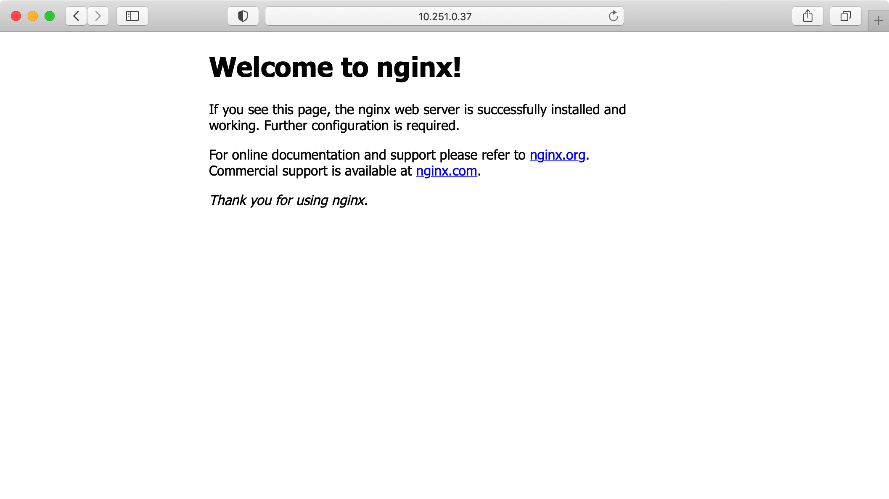

# 实验四 Kubernetes的基本使用

## 实验目的

- 了解Kubernetes的各种特性
- 掌握Kubernetes的常用功能

## 配置资源的两种方式

### 使用命令

回想之前我们刚刚初始化Kubernetes集群后，执行过的命令：

```bash
kubectl create deployment nginx-test --image=docker.scs.buaa.edu.cn/nginx --replicas=2 --port=80
```

使用kubectl命令创建资源时，会将Pod的配置都写入命令参数中。以我们执行过的`kubectl create`命令（在集群中使用指定镜像启动容器）为例，命令中包含了镜像名（`--image`）、伸缩情况（`--replicas`）。当然，`kubectl`命令还有许多其他的功能，详情可以在[Kubernetes文档-kubectl命令](https://kubernetes.io/docs/reference/generated/kubectl/kubectl-commands)看到。

直接使用kubectl创建资源简单、直观、快捷，很适合临时测试或者试验。但实际上，创建资源时通常需要一系列的配置，如果单纯使用kubectl命令会比较麻烦，因此通常在配置资源会使用yaml配置文件。

### 使用配置文件

在之前的实验中，我们使用了这个命令来安装Weave Scope

```bash
kubectl apply -f https://git.scs.buaa.edu.cn/iobs/static_files/raw/main/kube/weave_scope/scope.yml
```

这个命令实际上从后面的地址读取了一个yaml配置文件，并根据这个文件来配置资源。如果你将这个文件打开，你会看到这样的内容（省略了很多内容）：

```yaml
apiVersion: v1
kind: List
items:
  - apiVersion: v1
    kind: Namespace
    metadata:
      name: weave
      annotations:
        cloud.weave.works/version: v1.0.0-302-g76376bb
  - apiVersion: v1
    kind: ServiceAccount
    metadata:
      name: weave-scope
      labels:
        name: weave-scope
      namespace: weave
```

### YAML

> [YAML](https://yaml.org/)是一种可读性高、用来表达数据序列化的格式。YAML使用空白字符和分行来分隔数据，使用一些符号来标记清单、散列表、标量等资料形态。

常用的YAML语法：

- 对象（键值对）：用冒号结构表示。注意，键值对的key无需使用引号。
- 纯量：数值直接以字面量表示，布尔值用`true`和`false`表示，当值为空时，用`~`表示。一般情况下，字符串可以不用引号，但是当字符串中包含空格时则必须使用引号（单双均可）。字符串也可以写成多行，但从第二行开始，必须有一个单空格缩进。**换行符会被转换为空格**。对于多行字符串，使用`|`可以保留换行符，`+`表示保留文字块末尾的换行，`-`表示删除字符串末尾的换行。
- 数组：数组的成员前以`-`标记，每个成员一行；也可以在同一行内使用`[]`。例如：

事实上，我们常用的用于数据传递的JSON语法是YAML1.2版的子集，将上面的YAML文件转换为我们可能更加熟悉的JSON格式的话：

```json
{
  "apiVersion": "v1",
  "kind": "List",
  "items": [
    {
      "apiVersion": "v1",
      "kind": "Namespace",
      "metadata": {
        "name": "weave",
        "annotations": {
          "cloud.weave.works/version": "v1.0.0-302-g76376bb"
        }
      }
    },
    {
      "apiVersion": "v1",
      "kind": "ServiceAccount",
      "metadata": {
        "name": "weave-scope",
        "labels": {
          "name": "weave-scope"
        },
        "namespace": "weave"
      }
    }
  ]
}
```

这个例子应该可以帮助你理解YAML格式。节选的YAML配置文件会让Kubernetes进行如下工作：

- 创建一个Namespace，名字为"weave"，并且将版本信息加到了注释上
- 创建一个ServiceAccount，名字为"weave-scope"，并且也注释了一些信息

## 调度Pod

前面我们已经稍微了解到，Kubernetes通过各种Controller来管理Pod的生命周期，Kubernetes也提供了数种不同功能的内置Controller。每个控制器管理集群状态的一个特定方面。最常见的情况是：一个特定的控制器使用一种类型的资源作为它的期望状态，控制器管理控制另外一种类型的资源向它的期望状态发展。

### Deployment

回忆我们运行的第一个Pod：

    运行一个Nginx镜像

    ```bash
    kubectl create deployment nginx-test --image=docker.scs.buaa.edu.cn/nginx --replicas=2 --port=80
    ```

    查看创建结果

    ```bash
    sudo kubectl get deployment nginx-test
    ```

可以发现我们在查看它的时候使用的是`get deployment`命令。事实上我们已经部署了包含两个副本的Deployment，它的名字就是`nginx-test`。

> 一个Deployment控制器为Pods和ReplicaSets提供描述性的更新方式：描述Deployment中的期望状态，并且Deployment控制器以受控速率更改实际状态，以达到期望状态。

在这个例子中，我们的“期望状态”就是启动一个有两个副本的Nginx镜像。在这个过程中，我们创建了一个Deployment对象，通过Deployment生成了对应的ReplicaSet并完成了Pod副本的创建过程。除此之外，Deployment的主要功能还有以下几个：

- 检查Deployment的状态来看部署动作是否完成（Pod副本的数量是否达到了预期的值）
  - 例如，在本例中，如果你执行`kubectl create`命令后马上执行`kubectl get deployment`命令，你可能会看到`READY`一栏并不是`2/2`，`AVAILABLE`一栏也不是`2`，也就是说，部署动作尚未完成，Pod副本数量没有达到预期的值（2）。
- 更新Deployment以创建新的Pod（比如镜像升级）
- 回滚之前的Deployment版本
- 暂停Deployment（修改Pod中的镜像信息，之后再恢复Deployment进行新的发布）
- 扩展Deployment（以应对高负载情况）
- 清理不再需要的旧版本ReplicaSet

- 查看更详细的信息：`kubectl describe deployment nginx-test`

  ```
  Name:                   nginx-test
  Namespace:              default
  CreationTimestamp:      Fri, 14 May 2021 15:46:51 +0800
  Labels:                 app=nginx-test
  Annotations:            deployment.kubernetes.io/revision: 1
  Selector:               app=nginx-test
  Replicas:               2 desired | 2 updated | 2 total | 2 available | 0 unavailable
  StrategyType:           RollingUpdate
  MinReadySeconds:        0
  RollingUpdateStrategy:  25% max unavailable, 25% max surge
  Pod Template:
    Labels:  app=nginx-test
    Containers:
    nginx:
      Image:        docker.scs.buaa.edu.cn/nginx
      Port:         80/TCP
      Host Port:    0/TCP
      Environment:  <none>
      Mounts:       <none>
    Volumes:        <none>
  Conditions:
    Type           Status  Reason
    ----           ------  ------
    Available      True    MinimumReplicasAvailable
    Progressing    True    NewReplicaSetAvailable
  OldReplicaSets:  <none>
  NewReplicaSet:   nginx-test-6884fd56dd (2/2 replicas created)
  Events:          <none>
  ```

大多数内容都是自解释的，比如Deployment的名字、命名空间、创建时间等等。我们主要关注最后的一些信息：`NewReplicaSet`和`Events`。这些信息告诉我们Deployment创建了一个新的ReplicaSet，其中包含2个副本。

#### Deployment配置文件

以之前的`nginx-test`为例，它的配置文件可以写成

```yaml
#nginx-test
apiVersion: apps/v1
kind: Deployment
metadata:
  name: nginx-test
spec:
  replicas: 2
  selector:
    matchLabels:
      run: nginx-test
  template:
    metadata:
      labels:
        run: nginx-test
    spec:
      containers:
      - name: nginx
        image: docker.scs.buaa.edu.cn/nginx
        ports:
        - containerPort: 80
          protocol: TCP
```

将上述内容写入文件`nginx.yml`中，然后执行：

```bash
kubectl apply -f nginx.yml
```

其效果与我们在实验三中直接执行`kubectl create deployment nginx-test --image=docker.scs.buaa.edu.cn/nginx --replicas=2 --port=80`效果是完全一样的。

在上述这个文件`nginx.yml`中：

- `apiVersion` 当前配置所使用的API版本。其格式为`组/版本号`，例如刚刚使用的配置文件中，使用Deployment要表明API版本为`apps/v1`。
- `kind` 当前配置资源的类型
- `metadata` 当前配置资源的元数据。其中`name`是必填项。
- `spec` 当前资源的规格，此处为Deployment的规格
  - `replicas` 副本数
  - `selector` 选择控制的Pod
    - `matchLabels`
  - `template` Pod的模板
    - `metadata` Pod的元数据，至少要定义一个label。每个label是一个键值对，key和value都可以自定义。为了和使用`kubectl run`创建的Deployment保持一致，这里用了`run: nginx-test`。
      - `labels`
    - `spec` Pod的规格。此部分定义Pod中每一个容器的属性，对于每一个容器，`name`和`image`是必须的。
      - `ports`中详细指明了该容器需要向外暴露哪些端口。

### ReplicaSet

> ReplicaSet确保任何时间都有指定数量的Pod副本在运行。虽然ReplicaSet可以独立使用，但如今它主要被Deployment用作协调Pod创建、删除和更新的机制。Deployment是一个更高级的概念，它管理ReplicaSet，并向Pod提供声明式的更新以及许多其他有用的功能（比如版本记录、回滚、暂停升级等高级特性）。实际上，我们可能永远**不需要**操作ReplicaSet对象，而是使用Deployment。

查看由Deployment创建的ReplicaSet

```bash
kubectl get replicaset
```

```
NAME                    DESIRED   CURRENT   READY   AGE
nginx-test-6884fd56dd   2         2         2       6h7m
```

查看ReplicaSet的详细信息

```bash
kubectl describe replicaset nginx-test-6884fd56dd
```

```
Name:           nginx-test-6884fd56dd
Namespace:      default
Selector:       app=nginx-test,pod-template-hash=6884fd56dd
Labels:         app=nginx-test
                pod-template-hash=6884fd56dd
Annotations:    deployment.kubernetes.io/desired-replicas: 2
                deployment.kubernetes.io/max-replicas: 3
                deployment.kubernetes.io/revision: 1
Controlled By:  Deployment/nginx-test
Replicas:       2 current / 2 desired
Pods Status:    2 Running / 0 Waiting / 0 Succeeded / 0 Failed
Pod Template:
  Labels:  app=nginx-test
           pod-template-hash=6884fd56dd
  Containers:
   nginx:
    Image:        docker.scs.buaa.edu.cn/nginx
    Port:         80/TCP
    Host Port:    0/TCP
    Environment:  <none>
    Mounts:       <none>
  Volumes:        <none>
Events:           <none>
```

`Controlled By`指明了此ReplicaSet是由我们之前创建的Deployment所创建的。那么Pod是由什么创建的呢？在之前我们查看Pod时已经知道了Pod的Name，直接查看Pod的详细信息：

查看Pod详细信息

```bash
kubectl describe pod nginx-test-6884fd56dd-8j7sg
```

```
Name:         nginx-test-6884fd56dd-8j7sg
Namespace:    default
Priority:     0
Node:         k8s-master/10.251.254.114
Start Time:   Fri, 14 May 2021 15:46:51 +0800
Labels:       app=nginx-test
              pod-template-hash=6884fd56dd
Annotations:  <none>
Status:       Running
IP:           10.42.0.17
IPs:
  IP:           10.42.0.17
Controlled By:  ReplicaSet/nginx-test-6884fd56dd
Containers:
  nginx:
    Container ID:   containerd://135a7109de612ec0b0e35e9b9cf3599ffd66f8e383d3a0b02c86d514fd4288fd
    Image:          docker.scs.buaa.edu.cn/nginx
    Image ID:       docker.scs.buaa.edu.cn/nginx@sha256:42bba58a1c5a6e2039af02302ba06ee66c446e9547cbfb0da33f4267638cdb53
    Port:           80/TCP
    Host Port:      0/TCP
    State:          Running
      Started:      Fri, 14 May 2021 15:46:52 +0800
    Ready:          True
    Restart Count:  0
    Environment:    <none>
    Mounts:
      /var/run/secrets/kubernetes.io/serviceaccount from kube-api-access-2fhnf (ro)
Conditions:
  Type              Status
  Initialized       True
  Ready             True
  ContainersReady   True
  PodScheduled      True
Volumes:
  kube-api-access-2fhnf:
    Type:                    Projected (a volume that contains injected data from multiple sources)
    TokenExpirationSeconds:  3607
    ConfigMapName:           kube-root-ca.crt
    ConfigMapOptional:       <nil>
    DownwardAPI:             true
QoS Class:                   BestEffort
Node-Selectors:              <none>
Tolerations:                 node.kubernetes.io/not-ready:NoExecute op=Exists for 300s
                             node.kubernetes.io/unreachable:NoExecute op=Exists for 300s
Events:                      <none>
```

同样地，从`Controlled By`中我们可以看到，这里的Pod是由ReplicaSet创建的。根据以上的创建结果，我们可以大概推断出Kubernetes在这个过程中都做了什么：

- 用户通过kubectl创建了Deployment，名为`nginx-test`
- 该Deployment创建了ReplicaSet，名为`nginx-test-6884fd56dd`
- 该ReplicaSet创建了**两个**Pod，名为`nginx-test-6884fd56dd-8j7sg`和`nginx-test-6884fd56dd-rqjxv`

同时我们也可以发现，Kubernetes的对象命名方式：`对象名=父对象名+字符串`

现在，使用`kubectl create`创建的Pod已经完成了它的使命，之后我们会用新的方式创建新的Pod。

删除之前部署的Nginx

```bash
sudo kubectl delete deployment nginx-test
```

### 伸缩

伸缩是指在线增加或减少Pod的副本数。

使用前面所说的yml文件的方式再次创建一个名为`nginx-test`的Deployment。

```bash
kubectl apply -f nginx.yml
```

我们创建的Deployment有两个副本，执行`kubectl get pod -o wide`可以看到，两个副本分别运行在master节点和普通节点上：

```
NAME                          READY   STATUS    RESTARTS   AGE   IP           NODE         NOMINATED NODE   READINESS GATES
nginx-test-6478975c66-jtd2r   1/1     Running   0          17s   10.42.0.15   k8s-master   <none>           <none>
nginx-test-6478975c66-vj48s   1/1     Running   0          17s   10.42.1.92   k8s-node     <none>           <none>
```

修改yaml配置文件，将`replicas`改为5，并再次执行

```bash
kubectl apply -f nginx.yml
```

再次查看Pod 

```bash
kubectl get pod -o wide
```
  
```
NAME                          READY   STATUS    RESTARTS   AGE   IP           NODE         NOMINATED NODE   READINESS GATES
nginx-test-6478975c66-jtd2r   1/1     Running   0          66s   10.42.0.15   k8s-master   <none>           <none>
nginx-test-6478975c66-vj48s   1/1     Running   0          66s   10.42.1.92   k8s-node     <none>           <none>
nginx-test-6478975c66-8fl7v   1/1     Running   0          5s    10.42.1.93   k8s-node     <none>           <none>
nginx-test-6478975c66-dgqn5   1/1     Running   0          5s    10.42.1.95   k8s-node     <none>           <none>
nginx-test-6478975c66-zfpj2   1/1     Running   0          5s    10.42.1.94   k8s-node     <none>           <none>
```
  
Pod副本数已经变为了5个。

再次修改yaml配置文件，将replicas修改为3，并应用更改，再次查看Pod

```
NAME                          READY   STATUS    RESTARTS   AGE    IP           NODE         NOMINATED NODE   READINESS GATES
nginx-test-6478975c66-jtd2r   1/1     Running   0          106s   10.42.0.15   k8s-master   <none>           <none>
nginx-test-6478975c66-vj48s   1/1     Running   0          106s   10.42.1.92   k8s-node     <none>           <none>
nginx-test-6478975c66-dgqn5   1/1     Running   0          45s    10.42.1.95   k8s-node     <none>           <none>
```

Pod副本数变为了3个。

### 故障转移

**由于服务器资源紧张的原因，本节涉及的开关机操作比较危险，很可能导致虚拟机长时间无响应，因此，本节内容只阅读理解相关内容即可，可以不实践操作。**

这里，我们使用直接关机的方式来模拟Kubernetes集群中有一台机器故障的情况。

将**node节点**关机，这一步可以在云平台上进行，也可以直接登录node节点，使用`sudo shutdown now`来直接关机。

**进行危险操作前的再次提醒：要在node节点上先添加允许ssh连接通过防火墙的规则，再开启node节点的防火墙。**

关机后，master节点会找不到node节点，因此node节点会变为`NotReady`状态。

> 可能需要等待一段时间才能看到节点状态变为`NotReady`。不过如果用curl访问node节点上的Nginx服务器，可以马上看到Nginx已经无响应了。

查看节点状态 `kubectl get node -o wide`
  
```
NAME         STATUS     ROLES                  AGE   VERSION        INTERNAL-IP      EXTERNAL-IP   OS-IMAGE             KERNEL-VERSION     CONTAINER-RUNTIME
k8s-master   Ready      control-plane,master   14d   v1.21.0+k3s1   10.251.254.114   <none>        Ubuntu 20.04.2 LTS   5.4.0-73-generic   containerd://1.4.4-k3s1
k8s-node     NotReady   <none>                 14d   v1.21.0+k3s1   10.251.254.110   <none>        Ubuntu 20.04.2 LTS   5.4.0-73-generic   containerd://1.4.4-k3s1
```
  
可以看到，node节点的状态已经更改为了`NotReady`

稍等几分钟后，查看Pod `kubectl get pod -o wide`

```
NAME                          READY   STATUS        RESTARTS   AGE     IP           NODE         NOMINATED NODE   READINESS GATES
nginx-test-6478975c66-jtd2r   1/1     Running       0          32m     10.42.0.15   k8s-master   <none>           <none>
nginx-test-6478975c66-dgqn5   1/1     Terminating   0          31m     10.42.1.95   k8s-node     <none>           <none>
nginx-test-6478975c66-vj48s   1/1     Terminating   0          32m     10.42.1.92   k8s-node     <none>           <none>
nginx-test-6478975c66-n7mmj   1/1     Running       0          5m52s   10.42.0.16   k8s-master   <none>           <none>
nginx-test-6478975c66-jndr8   1/1     Running       0          5m52s   10.42.0.17   k8s-master   <none>           <none>
```

原来在node节点上的两个Pod副本，都处于`Terminating`状态。并且master节点上新增了两个Pod副本。处于正常运行状态的Pod副本的总数依然维持在三个。

进入云平台，打开刚才关掉的服务器，一段时间后再次查看node列表和Pod列表，可以看到节点已经恢复为了`Ready`状态，处于`Terminating`的Pod已经被删除。

### Job

Job会创建一个或多个Pod，并确保指定数量的Pod成功终止。当Pod成功完成时，Job将追踪成功完成的情况。当达到指定的成功完成次数时，Job就完成了。删除一个Job将清除它所创建的Pod。Job一般用于定义并启动一个批处理任务。批处理任务通常并行（或串行）启动多个计算进程去处理一批工作项，处理完成后，整个批处理任务结束。

Kubernetes支持一下几种Job:

- 非并行Job: 通常创建一个Pod直至其成功结束
- 固定结束次数的Job: 设置`.spec.completions`，创建多个Pod，直到`.spec.completions`个Pod成功结束
- 带有工作队列的并行Job: 设置`.spec.Parallelism`但不设置`.spec.completions`，当所有Pod结束并且至少一个成功时，Job就认为是成功。

一个运行一次的Job例子:

```yaml
apiVersion: batch/v1
kind: Job
metadata:
  name: pi
spec:
  # completions: 1
  # parallelism: 1
  template:
    metadata:
      name: pi
    spec:
      containers:
        - name: pi
          image: docker.scs.buaa.edu.cn/perl
          command: ["perl", "-Mbignum=bpi", "-wle", "print bpi(2000)"]
      restartPolicy: Never
```

#### Job yaml格式

>- RestartPolicy: Pod的重启策略，在这里仅支持`Never`或`OnFailure`
>- completions: 标志Job结束需要成功运行的Pod个数，默认为`1`
>- parallelism: 标志并行运行的Pod的个数，默认为`1`
>- activeDeadlineSeconds: 标志失败Pod的重试最大时间，超过这个时间不会继续重试
>- `container`中的`command`: 以**string数组**的格式输入待执行指令 (样例中为perl输出2000位数字的pi的语句)

运行该job:

```bash
kubectl create -f job.yaml
```

几分钟后，可以看到pod的创建情况 `kubectl get pod`：

```
NAME              READY   STATUS           RESTARTS   AGE
pi-5qng4          0/1     Completed        0          2m30s
```

此时Job已经按照预设的任务完成了，使用`kubectl logs <podname>`查看Pod的日志也能看到按照预设的command输出的2000位数字的$\pi$。

```
3.1415926535897932384626433832795028841971693993751058209749445923078164062862089986280348253421170679821480865132823066470938446095505822317253594081284811174502841027019385211055596446229489549303819644288109756659334461284756482337867831652712019091456485669234603486104543266482133936072602491412737245870066063155881748815209209628292540917153643678925903600113305305488204665213841469519415116094330572703657595919530921861173819326117931051185480744623799627495673518857527248912279381830119491298336733624406566430860213949463952247371907021798609437027705392171762931767523846748184676694051320005681271452635608277857713427577896091736371787214684409012249534301465495853710507922796892589235420199561121290219608640344181598136297747713099605187072113499999983729780499510597317328160963185950244594553469083026425223082533446850352619311881710100031378387528865875332083814206171776691473035982534904287554687311595628638823537875937519577818577805321712268066130019278766111959092164201989380952572010654858632788659361533818279682303019520353018529689957736225994138912497217752834791315155748572424541506959508295331168617278558890750983817546374649393192550604009277016711390098488240128583616035637076601047101819429555961989467678374494482553797747268471040475346462080466842590694912933136770289891521047521620569660240580381501935112533824300355876402474964732639141992726042699227967823547816360093417216412199245863150302861829745557067498385054945885869269956909272107975093029553211653449872027559602364806654991198818347977535663698074265425278625518184175746728909777727938000816470600161452491921732172147723501414419735685481613611573525521334757418494684385233239073941433345477624168625189835694855620992192221842725502542568876717904946016534668049886272327917860857843838279679766814541009538837863609506800642251252051173929848960841284886269456042419652850222106611863067442786220391949450471237137869609563643719172874677646575739624138908658326459958133904780275901
```

#### Cron Job定时任务

Kubernetes还提供了定时计划任务：

```yaml
apiVersion: batch/v1
kind: CronJob
metadata:
  name: hello
spec:
  schedule: "*/1 * * * *"
  jobTemplate:
    spec:
      template:
        spec:
          containers:
            - name: hello
              image: docker.scs.buaa.edu.cn/busybox
              args:
                - /bin/sh
                - -c
                - date; echo Hello from the Kubernetes cluster
          restartPolicy: OnFailure
```

与一般的Job相比，CronJob的主要不同点在于额外有了`schedule`及`jobTemplate`两个字段。`schedule`是定时表达式，其格式与Linux Cron的格式基本相同，如示例的cron表达式为每分钟执行一次。`jobTemplate`一节与Job中的`template`格式相同。

创建定时任务 `kubectl create -f cron.yml`

查看定时任务 `kubectl get cronjob`

```command
NAME    SCHEDULE      SUSPEND   ACTIVE   LAST SCHEDULE   AGE
hello   */1 * * * *   False     0        2s              47s
```

get命令只会输出上一次创建Job的时间，而不是所有。可以使用`watch`参数来更加直观地观察Job的创建过程 `kubectl get jobs --watch`

```command
NAME             COMPLETIONS   DURATION   AGE
hello-27032437   1/1           1s         2m34s
hello-27032438   1/1           1s         94s
hello-27032439   1/1           1s         34s
```
  
可以看到，每隔60s就会创建一个容器。

获取其中一个job的Pod `kubectl get pods --selector=job-name=hello-27032439 --output=jsonpath={.items[*].metadata.name}`

执行上述命令后，会输出对应pod的名字
  
```command
hello-27032439-cxt45
```

查看Pod输出 `kubectl logs hello-27032439-cxt45`

```command
Tue May 25 12:59:24 UTC 2021
Hello from the Kubernetes cluster
```

- 最后，记得将计划任务删除，否则会一直运行。`kubectl delete -f cron.yml`

### 其他Controller

#### DaemonSet

DaemonSet用于管理在集群中每个Node上运行且仅运行一份Pod的副本实例，一般来说，在以下情形中会使用到DaemonSet：

- 在每个Node上都运行一个存储进程
- 在每个Node上都运行一个日志采集程序
- 在每个Node上都运行一个性能监控程序

#### StatefulSet

StatefulSet用来搭建**有状态**的应用集群（比如MySQL、MongoDB等）。Kubernetes会保证StatefulSet中各应用实例在创建和运行的过程中，都具有固定的身份标识和独立的后端存储；还支持在运行时对集群规模进行扩容、保障集群的高可用等功能。

## Service

Service可以将运行在一组Pods上的应用程序公开为网络服务，简单地实现服务发现、负载均衡等功能。

k8s的Pods具有自己的生命周期，同一时刻运行的Pod集合与稍后运行的Pod集合很有可能不同（如发生更新、node故障等），Pods的IP地址可能会随时发生变化。这就会导致一个问题：如果一组后端Pods为集群内其他前端Pods提供功能，那么前端Pods该如何找出并跟踪需要连接的IP地址？通过Service，能够解耦这种关联，方便的通过Service地址访问到相应的Pods，前端不应该也没必要知道怎么访问、访问到的具体是哪一个Pod。

> Service一共有4种类型：
>
>- ClusterIP：通过集群的内部 IP 暴露服务，选择该值，服务只能够在集群内部可以访问，这也是默认的 `ServiceType`。
>- NodePort： 通过每个 Node 上的 IP 和静态端口（NodePort）暴露服务。NodePort 服务会路由到 ClusterIP 服务，这个 ClusterIP 服务会自动创建。通过请求 \<NodeIP\>:\<NodePort\>，可以从集群的外部访问一个 NodePort 服务。
>- LoadBalancer：使用云提供商的负载局衡器，可以向外部暴露服务。外部的负载均衡器可以路由到 NodePort 服务和 ClusterIP 服务。仅作了解。
>- ExternalName：通过返回 CNAME 和它的值，可以将服务映射到 externalName 字段的内容（例如，在集群内查找my-service.my-namespace.svc时，k8s DNS service只返回foo.bar.example.com这样的CNAME record）。没有任何类型代理被创建，网络流量发生在DNS层面。由于ExternalName要求kube-dns而我们使用的是coredns，也只作了解。

### 创建Service

Service通常通过selector来选择被访问的Pod。

继续沿用我们之前所创建的nginx-test。查看Pod详细信息：

`kubectl describe pod nginx-test-6478975c66-jtd2r`

在Labels栏能看到如下的标签（selector使用该标签来选择被访问的Pod）：

```
Labels:       pod-template-hash=6478975c66
              run=nginx-test
```

因此可以通过下列yaml文件创建Service (将下面的内容写入`nginx-service.yaml`)

```yaml
#nginx-service.yaml

apiVersion: v1
kind: Service
metadata:
  name: nginx-test-service
  labels:
    svc: nginx-test-svc
spec:
  ports:
    - port: 80
      protocol: TCP
  selector:
    run: nginx-test
```

>- port：Service暴露在集群IP上的端口。集群内通过\<clusterIP\>:\<port\>可以访问Service。
>- targetPort：被代理的Pod上的端口。默认与port相同。
>- nodePort：Service暴露在节点外部IP上的端口。集群外通过\<nodeIP\>:\<nodePort\>可以访问Service。仅在`spec.type=NodePort`时可用(`spec.type`默认为`ClusterIP`)。
>- name：端口名称，当Service具有多个端口时必须为每个端口提供唯一且无歧义的端口名称。

创建Service

```
kubectl apply -f nginx-service.yaml
```

查看service `kubectl get svc`

```
NAME                 TYPE        CLUSTER-IP     EXTERNAL-IP   PORT(S)   AGE
kubernetes           ClusterIP   10.43.0.1      <none>        443/TCP   15d
nginx-test-service   ClusterIP   10.43.149.18   <none>        80/TCP    11s
```

可以看到，第二个就是我们刚才创建的service，其中，它有一个cluster-ip：`10.43.149.18`。

验证是否可以通过Service访问Pod，注意，上述这个IP是“cluster-ip”，也就是说，它是一个集群内ip，因此，只能在集群中的机器上访问：

```bash
curl 10.43.149.18
```

```html
<!DOCTYPE html>
<html>
<head>
<title>Welcome to nginx!</title>
<style>
    body {
        width: 35em;
        margin: 0 auto;
        font-family: Tahoma, Verdana, Arial, sans-serif;
    }
</style>
</head>
<body>
<h1>Welcome to nginx!</h1>
<p>If you see this page, the nginx web server is successfully installed and
working. Further configuration is required.</p>

<p>For online documentation and support please refer to
<a href="http://nginx.org/">nginx.org</a>.<br/>
Commercial support is available at
<a href="http://nginx.com/">nginx.com</a>.</p>

<p><em>Thank you for using nginx.</em></p>
</body>
</html>
```

查看当前三个Pods的IP地址 `kubectl get pod -l run=nginx-test -o wide`

```command
NAME                          READY   STATUS    RESTARTS   AGE     IP           NODE         NOMINATED NODE   READINESS GATES
nginx-test-6478975c66-jtd2r   1/1     Running   0          5h48m   10.42.0.15   k8s-master   <none>           <none>
nginx-test-6478975c66-n7mmj   1/1     Running   0          5h22m   10.42.0.16   k8s-master   <none>           <none>
nginx-test-6478975c66-jndr8   1/1     Running   0          5h22m   10.42.0.17   k8s-master   <none>           <none>
```

删除这三个Pods并等待Deployment重新创建

```command
~$ kubectl delete pods -l run=nginx-test
pod "nginx-test-79cd7499bf-vrlss" deleted
pod "nginx-test-79cd7499bf-zd42s" deleted
~$ kubectl get pod -l run=nginx-test -o wide
NAME                          READY   STATUS    RESTARTS   AGE   IP            NODE       NOMINATED NODE   READINESS GATES
nginx-test-6478975c66-7ktl4   1/1     Running   0          21s   10.42.1.109   k8s-node   <none>           <none>
nginx-test-6478975c66-cffrr   1/1     Running   0          21s   10.42.1.111   k8s-node   <none>           <none>
nginx-test-6478975c66-jssj4   1/1     Running   0          21s   10.42.1.110   k8s-node   <none>           <none>
```

可以看到重新创建的三个Pods的IP地址已经发生变化，再次通过Service，仍能访问对应的Pod

```bash
curl 10.97.91.103
```

```html
<!DOCTYPE html>
<html>
<head>
<title>Welcome to nginx!</title>
<style>
    body {
        width: 35em;
        margin: 0 auto;
        font-family: Tahoma, Verdana, Arial, sans-serif;
    }
</style>
</head>
<body>
<h1>Welcome to nginx!</h1>
<p>If you see this page, the nginx web server is successfully installed and
working. Further configuration is required.</p>

<p>For online documentation and support please refer to
<a href="http://nginx.org/">nginx.org</a>.<br/>
Commercial support is available at
<a href="http://nginx.com/">nginx.com</a>.</p>

<p><em>Thank you for using nginx.</em></p>
</body>
</html>
```

### 暴露端口

之前创建的Service并没有指定类型，因此为默认的ClusterIP，只能在集群内部访问。如果需要将服务端口暴露在公网，可以使用NodePort类型。

将`nginx-service.yaml`修改为下面的内容

```yaml
#nginx-service.yaml

apiVersion: v1
kind: Service
metadata:
  name: nginx-test-service
  labels:
    svc: nginx-test-svc
spec:
  type: NodePort
  ports:
    - port: 80
      nodePort: 32180
      protocol: TCP
      name: http
  selector:
    run: nginx-test
```

修改Service `kubectl apply -f nginx-service.yaml`

查看service `kubectl get svc nginx-test-service`

```command
NAME                 TYPE       CLUSTER-IP      EXTERNAL-IP   PORT(S)        AGE
nginx-test-service   NodePort   10.43.115.127   <none>        80:32180/TCP   17s
```

此时，从集群内任一节点IP的32180端口均可访问到某个Pod的80端口。

比如，你的两台虚拟机的IP分别为`10.255.9.80`和`10.255.9.81`，那么，你在校园网内的任何一台机器上，执行`curl http://10.255.9.80:32180`或者`curl http://10.255.9.81:32180`，都能得到如下的输出：

```html
<!DOCTYPE html>
<html>
<head>
<title>Welcome to nginx!</title>
<style>
    body {
        width: 35em;
        margin: 0 auto;
        font-family: Tahoma, Verdana, Arial, sans-serif;
    }
</style>
</head>
<body>
<h1>Welcome to nginx!</h1>
<p>If you see this page, the nginx web server is successfully installed and
working. Further configuration is required.</p>

<p>For online documentation and support please refer to
<a href="http://nginx.org/">nginx.org</a>.<br/>
Commercial support is available at
<a href="http://nginx.com/">nginx.com</a>.</p>

<p><em>Thank you for using nginx.</em></p>
</body>
</html>
```

或者在浏览器中也可以访问：



可以尝试删除Pods并等待新的Pods创建完成，仍可以通过上述方式访问。

## 滚动更新

为了在更新服务的同时不中断服务，kubectl支持**滚动更新**，它一次更新一个Pod，而不是停止整个服务。

使用Deployment可以查看升级详细进度和状态，当升级出现问题的时候，可以使用回滚操作回滚到指定的版本，每一次对Deployment的操作，都会保存下来，方便进行回滚操作，另外对于每一次升级都可以随时暂停和启动，拥有多种升级方案：**Recreate**删除现在的Pod，重新创建；**RollingUpdate**滚动升级，逐步替换现有Pod，对于生产环境的服务升级，显然这是一种最好的方式。

创建Deployment

```yaml
apiVersion: apps/v1
kind: Deployment
metadata:
  name: nginx
spec:
  replicas: 3
  selector:
    matchLabels:
      app: nginx
  template:
    metadata:
      labels:
        app: nginx
    spec:
      containers:
        - name: nginx
          image: docker.scs.buaa.edu.cn/softbuaa/nginx:1.16
```

使用`kubectl create -f nginx-deploy.yaml`，由于`replicas`为3，因此会创建三个Pod

```
NAME                          READY   STATUS        RESTARTS   AGE
nginx-77bf7f47fd-9q7fw        1/1     Running       0          80s
nginx-77bf7f47fd-567nf        1/1     Running       0          80s
nginx-77bf7f47fd-k795n        1/1     Running       0          80s
```

此时尝试访问Nginx主页，会看到版本提示。

> 注意：使用的镜像并不是官方原版镜像，而是修改了默认的index.html后的镜像。访问Nginx主页，既可以自己创建一个service进行访问，也可以查看pod的IP后直接在虚拟机上使用curl访问。

通过配置文件更新：
  
在刚刚的配置文件中将镜像修改为`softbuaa/nginx:1.17`，然后在`spec`中添加滚动升级策略，改动后如下

```yaml
apiVersion: apps/v1
kind: Deployment
metadata:
  name: nginx
spec:
  minReadySeconds: 5
  strategy:
    type: RollingUpdate
    rollingUpdate:
      maxSurge: 1
      maxUnavailable: 1
  replicas: 3
  selector:
    matchLabels:
      app: nginx
  template:
    metadata:
      labels:
        app: nginx
    spec:
      containers:
        - name: nginx
          image: docker.scs.buaa.edu.cn/softbuaa/nginx:1.17
```

- minReadySeconds:
  - Kubernetes在等待设置的时间后才进行升级
  - 如果没有设置该值，Kubernetes会假设该容器启动起来后就提供服务了
  - 如果没有设置该值，在某些极端情况下可能会造成服务服务正常运行
- maxSurge:
  - 升级过程中最多可以比原先设置多出的POD数量
  - 例如：maxSurage=1，replicas=5,则表示Kubernetes会先启动1一个新的Pod后才删掉一个旧的POD，整个升级过程中最多会有5+1个POD。
- maxUnavaible:
  - 升级过程中最多有多少个POD处于无法提供服务的状态
  - 当maxSurge不为0时，该值也不能为0
  - 例如：maxUnavaible=1，则表示Kubernetes整个升级过程中最多会有1个POD处于无法服务的状态。

然后执行命令 `kubectl apply -f nginx-deploy.yaml`

接着查看deployment的升级情况 `kubectl rollout status deploy/nginx`

```
Waiting for deployment "nginx" rollout to finish: 2 out of 3 new replicas have been updated...
Waiting for deployment "nginx" rollout to finish: 2 out of 3 new replicas have been updated...
Waiting for deployment "nginx" rollout to finish: 2 out of 3 new replicas have been updated...
Waiting for deployment "nginx" rollout to finish: 2 of 3 updated replicas are available...
Waiting for deployment "nginx" rollout to finish: 2 of 3 updated replicas are available...
deployment "nginx" successfully rolled out
```

执行`kubectl rollout status deploy/nginx`可以实时观测滚动更新的进度，在更新过程中，可以使用`kubectl rollout pause(resume) deployment <deployment>`来暂停(继续)更新

更新结束后，查看Replica Set的状态 `kubectl get replicaset`

```
NAME               DESIRED   CURRENT   READY   AGE
nginx-77bf7f47fd   0         0         0       8m28s
nginx-5b8c7c5877   3         3         3       3m7s
```

可以看到旧的Replica Set和新的Replica Set的状态，此时查看任意一个Pod的镜像信息

```

......

Containers:
  nginx:
    Container ID:   containerd://0790761a1248fcb4dc8d9432aebeb37ff7ee96b7267a83fe0172812323764e85
    Image:          docker.scs.buaa.edu.cn/softbuaa/nginx:1.17
    Image ID:       docker.scs.buaa.edu.cn/softbuaa/nginx@sha256:6f3b7f003243dca41dae46fe442e826df08e056a76cdd3e11e6f41cdaef

......

```

其中image的信息已经得到改动了。

此时再次尝试访问Nginx主页，会看到版本已经变化。

- 回滚Deployment

首先，查看Deployment的升级历史 `kubectl rollout history deploy/nginx`

```
deployment.apps/nginx
REVISION  CHANGE-CAUSE
1         <none>
2         <none>
```

其中，`1`和`2`为历史版本，可以带上参数来查看该次的版本信息 `kubectl rollout history deploy/nginx --revision=1`

```
deployment.apps/nginx with revision #1
Pod Template:
  Labels:	app=nginx
	pod-template-hash=77bf7f47fd
  Containers:
   nginx:
    Image:	docker.scs.buaa.edu.cn/softbuaa/nginx:1.16
    Port:	<none>
    Host Port:	<none>
    Environment:	<none>
    Mounts:	<none>
  Volumes:	<none>
```

可以使用`kubectl rollout undo deploy/nginx`来回退到上一个版本，也可以在后面加上参数`--to-revision=3`来回退到`3`所指定的历史版本

## 数据管理

Pod中的数据默认并没有进行持久化，它们会随着Pod的销毁而一同被消灭。 我们都知道，Pod并不总是稳定可靠的，它有可能会被频繁销毁并重建，我们并不希望重要的数据（例如MySQL中的数据）跟着Pod一同被销毁。这就需要引入一种持久的存储系统。

- Volume和Persistent Volume

Kubernetes提供了两种储存介质，它们是Volume和Persistent Volume。简单来说，Volume中的数据不能被持久化，Pod销毁，数据消失；而Persistent Volume中的数据则独立于Pod，即使Pod销毁，数据依然可以永久保存，除非你不希望。

- 常用的(Persistent) Volume
  - emptyDir(非Persistent Volume)
  - hostPath(Persistent Volume)
  - nfs(Persistent Volume)

### 使用hostPath

使用hostPath，将容器的`/storage`目录挂载到容器所在主机的`/home/storage`目录下

```yaml
apiVersion: v1
kind: Pod
metadata:
  name: hostpath-test
spec:
  containers:
    - name: busybox
      image: docker.scs.buaa.edu.cn/busybox:1.24
      volumeMounts:
        - name: storage
          mountPath: /storage #将容器的 /storage 目录作为挂载点
      args:
        - /bin/sh
        - -c
        - echo "test file" > /storage/test.txt
  restartPolicy: "Never"
  volumes:
    - name: storage
      hostPath:
        path: /home/buaa/storage # 挂载到主机的 /home/buaa/storage目录下
```

>- volumeMounts: container中需要被mount的目录
>- volumes: 根据name来对应container中的volumeMounts并选择mount到本地的路径

使用`kubectl get pod -o wide`可查看pod所在主机，进入主机查看`/home/buaa/storage`下的文件

```command
$ ls /home/buaa/storage
test.txt

$ cat /home/storage/test.txt
test file
```

hostPath的缺点为若使用一个pod需要跨主机到另外一台主机上重建，数据将会丢失，这时我们需要PersistentVolume来进行持久化

### 使用PV和PVC

两者的关系为：PV用于定义存储，而PVC用于向已有存储申请存储空间

用nfs来实现PV比较容易，因此用nfs来做实例

>- nfs:网络文件系统（英语：Network File System，缩写作 NFS）

nfs需要一个server端，一个client端，对于实验的Kubernetes集群来说，可将Master节点作为server同时为client(因为设置了Master节点开启工作负载)，其他所有从节点为client。

#### 配置nfs server端

在nfs服务器上安装nfs-kernel-server （理论上实验用的机器已经安装，如果没有，请自行联网安装）

```bash
apt install nfs-kernel-server
```

首先创建一个用于存放数据的文件夹

```bash
mkdir /data
```

接下来修改nfs的配置文件

```command
$ vim /etc/exports

#添加如下内容
/data *(rw,sync,no_root_squash)
```

其中：

>
>   - /data：   共享的目录
>   - \* ：   谁可以访问(这里设置为所有人能访问)
>   - (rw,sync,no_root_squash): 权限设置
>     - rw: 能读写
>     - sync: 同步
>     - no_root_squash: 不降低root用户的权限(不安全，不过本次实验选择这样做更方便)

重启nfs服务：

```bash
service nfs-kernel-server restart
```

在**所有节点**安装nfs-common （理论上实验用的机器已经安装，如果没有，请自行联网安装）

```bash
apt install nfs-common
```

安装好后可使用如下指令查看是否能看到nfs服务器的挂载点(x.x.x.x为nfs服务器的ip地址)

```command
$ showmount -e x.x.x.x
Export list for x.x.x.x:
/data *
```

这时候说明已经能够访问到这个挂载点了，使用以下指令将挂载点挂载到本地的`/mnt`路径下(x.x.x.x同样为nfs服务器地址)

```bash
mount x.x.x.x:/data /mnt
```

无提示则说明挂载成功，此时在nfs客户端上进行测试

`$ cd /mnt`
`$ touch success`

若看到nfs服务器上`/data`目录中出现`success`文件，则说明nfs已经部署成功，将集群所有机器都进行挂载(包括服务器本机)，在一个挂载点删除后，所有客户端和服务器也会同步删除

#### 创建PV

准备好nfs环境后，创建PersistentVolume(pv)

```yaml
apiVersion: v1
kind: PersistentVolume
metadata:
  name: nfspv
spec:
  capacity:
    storage: 1Gi
  accessModes:
    - ReadWriteOnce
  persistentVolumeReclaimPolicy: Retain
  storageClassName: nfs
  nfs:
    path: /data #要mount到的路径
    server: x.x.x.x #nfs服务器ip
```

>- accessModes:
>   - ReadWriteOnce -- PV能以read-write模式mount到单个节点
>   - ReadOnlyMany  -- PV能以read-only模式mount到多个节点
>   - ReadWriteMany -- PV能以read-write模式mount到多个节点
>- persistentVolumeReclaimPolicy
>   - Retain  -- 需要管理员手工回收
>   - Recycle -- 清除PV中的数据，效果相当于执行`rm -rf /thevolume/*`
>   - Delete  -- 删除Storage Provider上的对应存储资源
>- nfs
>   - path的路径要存在，若不存在，Pod无法正常运行，请提前手动创建好(动态pv无需手动创建)

使用指令`kubectl create -f <filename>`按照上述yaml文件创建PV后

```command
$ kubectl get pv
NAME    CAPACITY   ACCESS MODES   RECLAIM POLICY   STATUS      CLAIM   STORAGECLASS   REASON   AGE
nfspv   1Gi        RWO            Retain           Available           nfs                     3s
```

接下来创建PVC

```yaml
apiVersion: v1
kind: PersistentVolumeClaim
metadata:
  name: nfspvc
spec:
  accessModes:
    - ReadWriteOnce
  resources:
    requests:
      storage: 1Gi
  storageClassName: nfs
```

创建后查看PVC和PV的情况

```command
kubectl get pvc
NAME     STATUS   VOLUME   CAPACITY   ACCESS MODES   STORAGECLASS   AGE
nfspvc   Bound    nfspv    1Gi        RWO            nfs            5s
kubectl get pv
NAME    CAPACITY   ACCESS MODES   RECLAIM POLICY   STATUS   CLAIM            STORAGECLASS   REASON   AGE
nfspv   1Gi        RWO            Retain           Bound    default/nfspvc   nfs                     82m
```

发现pvc已经和pv绑定了，因为Kubernetes将查找满足申领要求的pv，并将pvc绑定到具有相同StorageClass的适当的pv上

接下来在裸Pod中使用PVC

```yaml
kind: Pod
apiVersion: v1
metadata:
  name: test-pod
spec:
  containers:
  - name: test-pod
    image: registry.cn-hangzhou.aliyuncs.com/google_containers/busybox:1.24
    command:
      - "/bin/sh"
    args:
      - "-c"
      - "touch /mnt/SUCCESS && exit 0 || exit 1"
    volumeMounts:
      - name: nfs-pvc
        mountPath: "/mnt" #此处为容器内的被挂载点，根据pv中的设置，将这个目录直接挂载到nfs服务器的/data目录下
  restartPolicy: "Never"
  volumes:
    - name: nfs-pvc
      persistentVolumeClaim:
        claimName: nfspvc
```

这个pod使用busybox来执行一段语句，在需要mount的路径下新建一个名为**SUCCESS**的文件。创建好pod后，等待pod的Status变为`Completed`之后，查看所有`/mnt`文件夹以及`/data`文件夹

```command
$ kubectl get pod
NAME                  READY   STATUS      RESTARTS   AGE
test-pod              0/1     Completed   0          10s
#pod已经完成，查看被挂载以及挂载目录

#nfs-server:
$ ls /data
SUCCESS

#nfs-client
$ls /mnt
SUCCESS
```

通过busybox创建文件已经通过pv存储在了nfs服务器中，并同步到了各个客户端的挂载点上。

实际上，只需要nfs服务器即可达到实验效果，使用客户端可加深对nfs的理解。

- 动态PV

动态PV是指使用PVC之前不需要创建PV，而是在PVC申请存储空间的时候自动根据条件创建，也叫做动态供给（Dynamical Provision）。动态供给的基础是StorageClass，详细可参考：[StorageClass](https://kubernetes.io/docs/concepts/storage/storage-classes/#the-storageclass-resource)

## 动手做

- 复现手册中提到的Kubernetes操作，并理解操作所涉及到的Kubernetes特性/功能

- 部署nginx服务
  - 创建nginx的Deployment
  - 复现故障转移和伸缩功能
  - 创建nginx的Service
    - ServiceType应为NodePort
    - Deployment的replicas至少为2
    - 为每个Nginx Pod创建不同的service.html
    - 通过Service NodePort对Pod的service.html进行多次curl，要求每次结果都不相同(因为被代理到了不同的Pod，且默认的选择算法为round-robin)，例如：

      ```command
      ~$ curl <nodeIP>:<nodePort>/service.html
      2
      ~$ curl <nodeIP>:<nodePort>/service.html
      1
      ```

      > Tips:
      >
      > 可以通过`kubectl exec -it <podName> -- bash`进入Pod内部
      > 要创建的文件位于`/usr/share/nginx/html/service.html`
      >容器内并未安装文本编辑器，可以通过`echo`和`cat`命令对`service.html`进行编辑，如
      >
      > ```
      > echo 'single string' > service.html
      > ```
      >
      > ```
      > cat > service.html <<EOF
      > complicated
      > string
      > with
      > multiple
      > lines
      > EOF
      > ```

  - 尝试使用滚动更新，对比前后主页版本 (可以自行创建Service通过代理访问网页，也可以直接curl ClusterIP访问。**注意浏览器缓存影响，学校的网页代理也会保存一段时间的缓存**)

- 部署持久化服务
  - 在集群中部署nfs环境
  - 创建pv和pvc
  - 创建mysql的Deployment和Service，确保绑定了pvc (**mysql的mount目录为/var/lib/mysql**)，创建MySQL时，可以使用镜像`docker.scs.buaa.edu.cn/mysql:8`
  - 查看nfs server的mount目录，mysql数据文件已经写入
