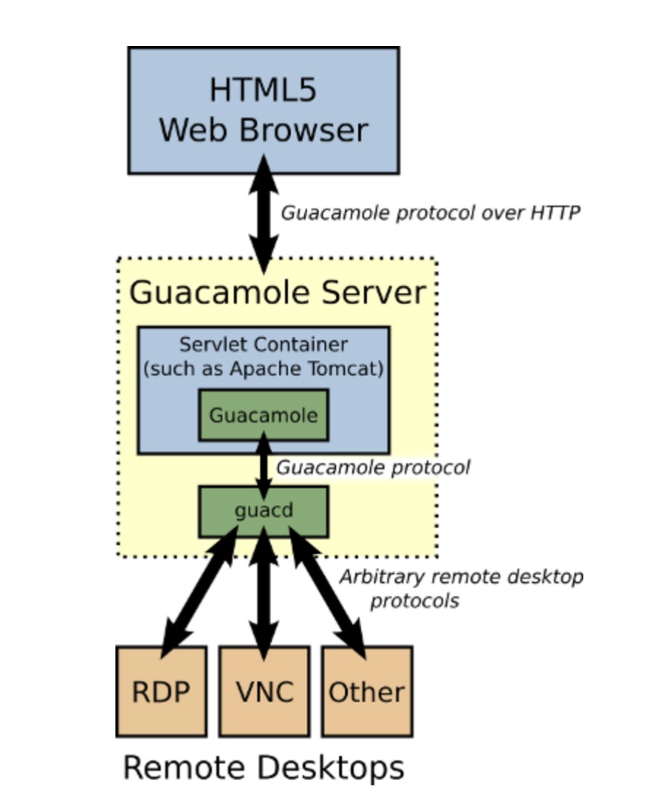
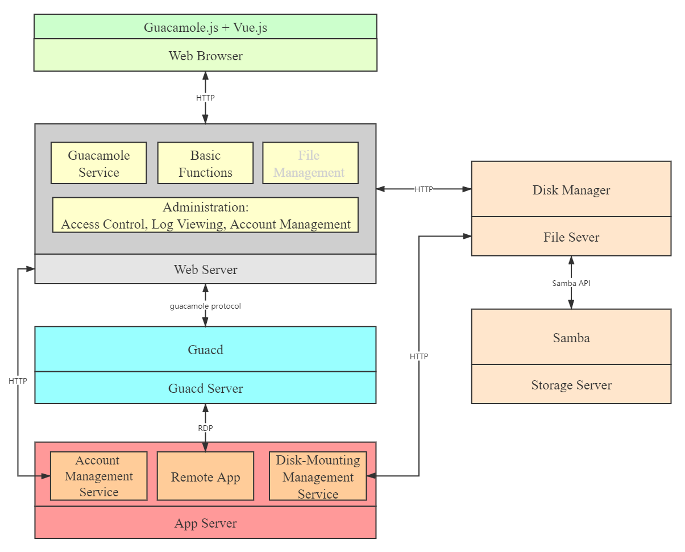

# 云计算实验指南

[toc]

---

## 实验四 构建简易的SaaS平台

### 实验目的

- 了解SaaS平台的用途
- 了解SaaS平台的技术原理
- 掌握Remote App服务器的搭建方法
- 了解Apache Guacamole的基本架构及用途
- 学习如何构建自己的SaaS平台

### SaaS简介

SaaS，是Software-as-a-Service的缩写名称，意思为软件即服务，即通过网络提供软件服务。

SaaS平台供应商将应用软件统一部署在自己的服务器上，客户可以根据工作实际需求，通过互联网向厂商定购所需的应用软件服务，按定购的服务多少和时间长短向厂商支付费用，并通过互联网获得Saas平台供应商提供的服务。

我们常用的视频会议软件、在线文档应用、在线作图工具等等，其实都属于SaaS的范畴。但是常见的商业化SaaS服务，一般都是提供一种（比如视频会议）或者一类（比如某些企业级财务软件）功能。而在本实验中，我们将试图使用一些技术，来构建通用型的SaaS平台。我们可以将一些桌面应用软件部署在服务器上，通过这个平台来向用户提供服务，用户只需要浏览器就可以使用运行在云端的桌面应用软件。

### Remote App简介

Remote App是微软在服务器版操作系统中集成的一项服务功能，其目的是使用户可以通过远程桌面访问远端的桌面与程序，客户端本机无需安装系统与应用程序的情况下也能正常使用远端发布的各种桌面与应用。应用程序都运行在服务器端，而客户端只是显示服务器运行额程序的结果，并将用户的键盘、鼠标输入反馈到服务器端执行相应的操作。

与我们平常访问Windows服务器时使用的远程桌面一样，访问Remote App时使用的也是RDP协议。一般连接远程桌面与直接操作物理机几乎没有差别，在远程桌面环境下可以任意访问、修改系统中的各种程序或数据；而与连接远程桌面不同，连接Remote App仅支持访问特定开放的应用程序，结合一些组策略限制，可以达到更严格的访问控制。总而言之，对于一台服务器来说，拿到远程桌面权限的用户可以进行任何操作；而拿到Remote App访问权限的不同用户则可以在硬件条件允许的情况下，同时访问相同或不同的应用程序，而不必担心，也不会相互产生影响。

### Apache Guacamole简介

[Apache Guacamole](http://guacamole.apache.org/)是一个无需安装客户端即可访问远程服务器的远程桌面网关。上文中我们提到Remote App使用的也是RDP协议，一般情况下，我们会使用Windows自带的远程桌面连接(mstsc)或者其他客户端来进行连接。借助Guacamole，用户就可以不使用客户端，而直接通过网页来访问Remote App。下图是Guacamole的架构及工作流程。在本实验中，Guacamole可以理解为一个网页版的远程桌面连接。

具体说来，Guacamole分为部分：向用户提供网页服务的"guacamole-client"、收集用户操作并与相应的远程桌面通讯的"guacamole-server"。在本实验中，我们一般不会去修改guacamole-server部分的代码，这部分功能相对固定；我们有可能会修改"guacamole-client"的代码，或使用这部分代码，来构建自己的SaaS平台。

### SaaS平台的架构

要构建一个SaaS平台，可以参考如下的架构：

#### 网页端（Web Browser）

在一般前端（比如Vue、React等等框架）的基础上，加上额外的Guacamole相关代码。这部分比较简单，不多赘述。

#### 服务器管理端（Web Server）

与一般的服务后端相同，都包括基本管理功能（账号管理、日志管理以及其他基本功能等）。不同的是，SaaS平台的后端会包含Guacamole Client相关的功能模块来与Guacd通信来访问和控制远程桌面资源。特别地，用户在云端可能会产生一些有用的文件需要取回本地，我们还应该提供文件管理的相关组件。

在本实验中，我们先完全使用Guacamole官方提供的Docker镜像，以便更加快速地了解Guacamole的用法及特点。

> 在一般的云环境中，文件相关的问题都可以通过诸如FTP、SFTP、SCP解决，Windows远程桌面则更加便利，可以直接在云端和本地之间复制文件。但在使用Remote App时，由于一台服务器会有多个用户使用，为了用户数据安全考虑，不能允许用户直接访问服务器的公共磁盘。要给不同的用户使用独立的存储空间，就需要一个单独的服务来管理和挂载用户的独立磁盘。

#### 其他

Guacd Server是运行Guacd进程的服务器，在本实验中，我们使用Guacamole官方提供的Docker镜像。File Server以及Storage Server负责存储文件相关的服务，其中File Server也可以作为服务后端的一个模块来统一进行管理，提供用户文件的存取功能；Storage Server则负责直接存储文件（可以使用Samba，也可以使用FreeNas等其他解决方案）。App Server是运行Remote App的Windows服务器，由于连接Remote App需要使用Windows账号，因此该服务器上还应有账号创建相关的服务，自动化创建账号；同时，考虑我们之前所说的存储问题，还应有负责挂载网络硬盘的服务。

### 配置Remote App服务器

#### 环境要求

- Windows Server服务器（本实验中使用Windows Server2019）
  - Remote App功能需要服务器加入域

### 配置Guacamole

#### 使用Docker部署Guacamole

需要使用guacad、guacamole、MySQL三个镜像。
`docker pull guacamole/guacad`

数据库初始化

进入

root@1fa4d4fb5dba:/# mysql -uroot -p@buaa21 -Dguacamole < initdb.sql

#### 使用Tomcat部署Guacamole

### 验证
