- 打开服务器管理器，选择添加角色或功能
  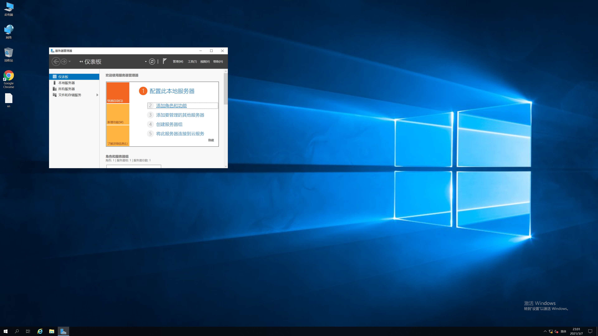
- 选择基于角色或功能的安装
  
- 选择当前服务器
  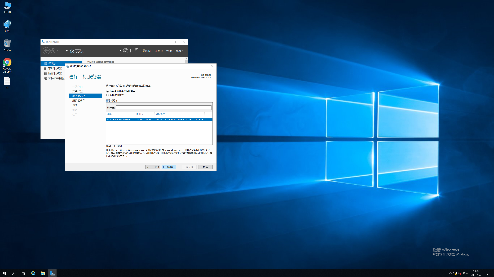
- 选择AD域服务并确定
  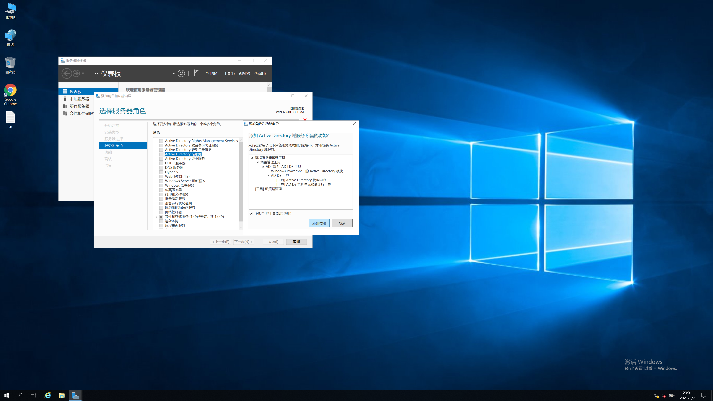
- 依次下一步
  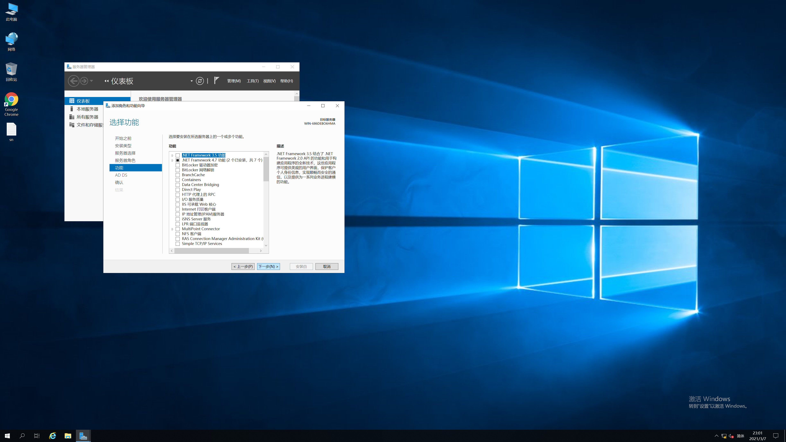
  
  
  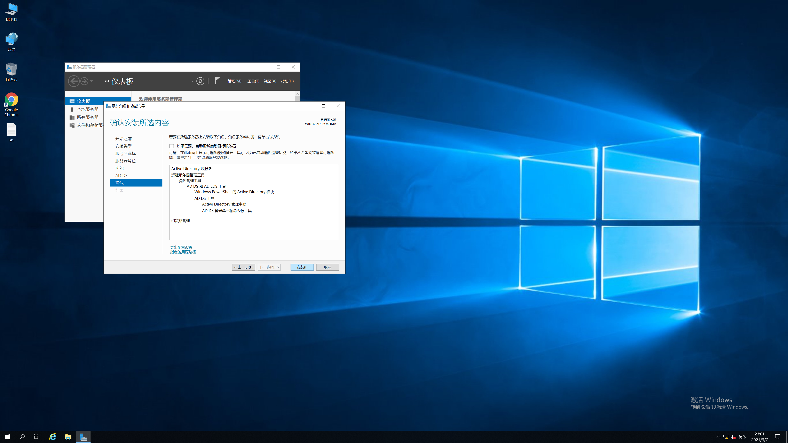
- 将服务器设置为域控制器，点击上方警告后的“更多”
  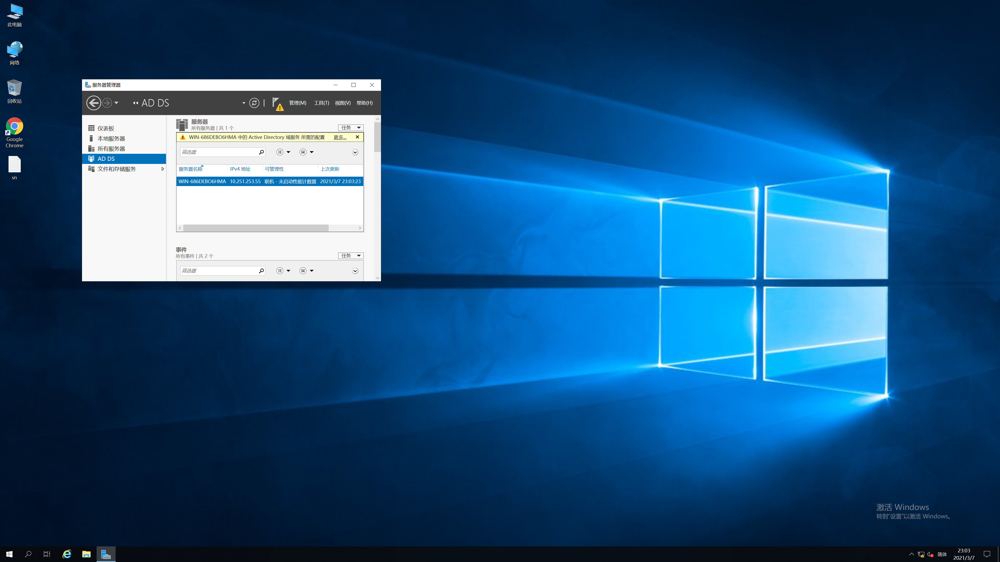
- 点击上方消息后的“将此服务器提升为域控制器”
  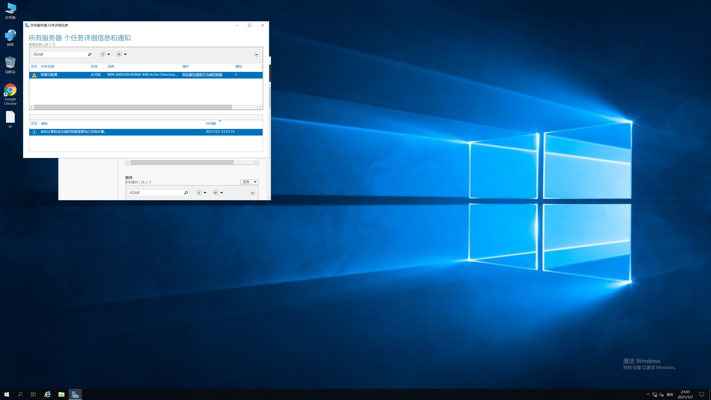
- 填写根域名，由于不会使用到，实际上可以随意填写
  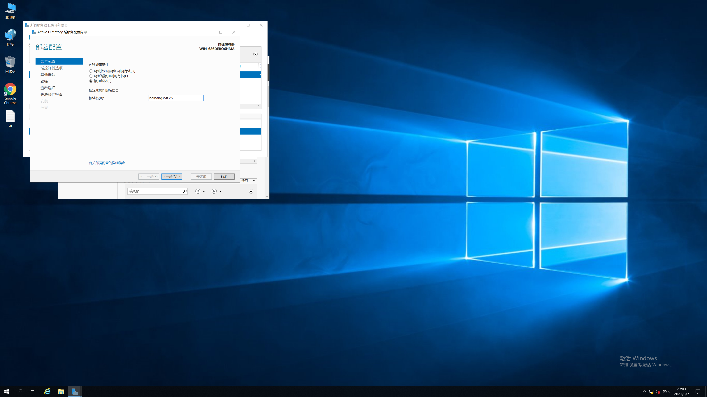
- 设置还原密码
  
- 此处警告可忽略
  
- 使用默认值即可
  
- 依次下一步，并点击安装
  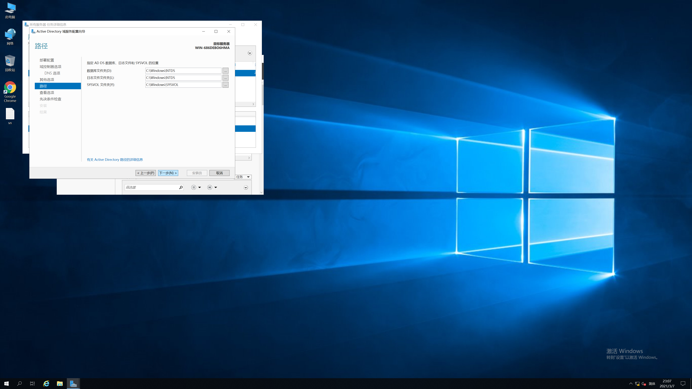
  
  
- 等待安装结束，域部分的配置到此结束。

---

配置Remote App相关的远程桌面功能。

- 打开服务器管理器，选择添加角色或功能，选择远程桌面服务安装
  
- 类型选择快速启动
  
- 选择基于会话的桌面部署
  
- 选择本地服务器
  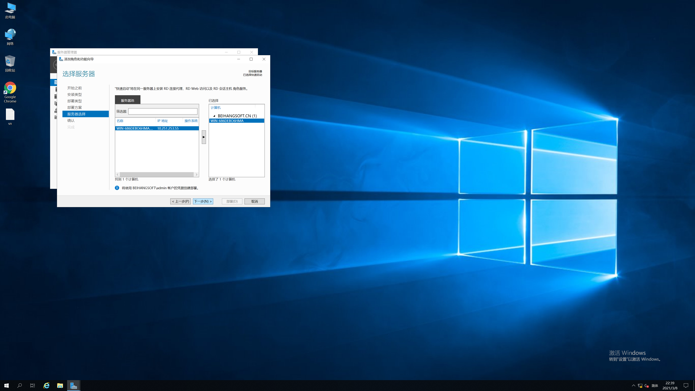
- 将需要时重启选项打勾，并点击部署
  
- 部署成功后会自动重启
  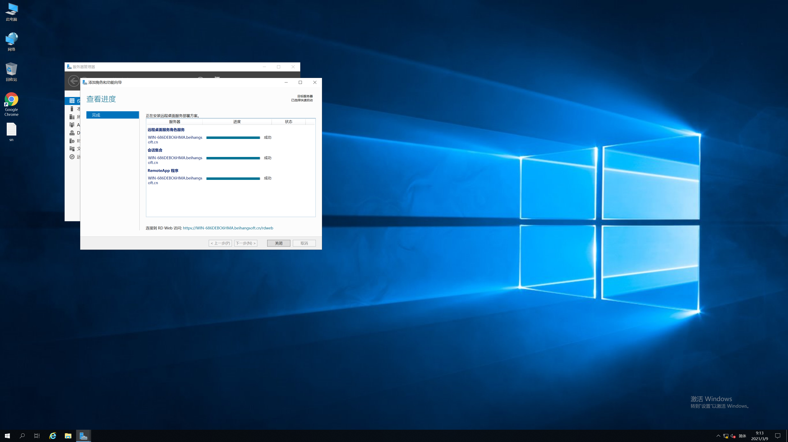
- Windows Server基础配置到此结束。